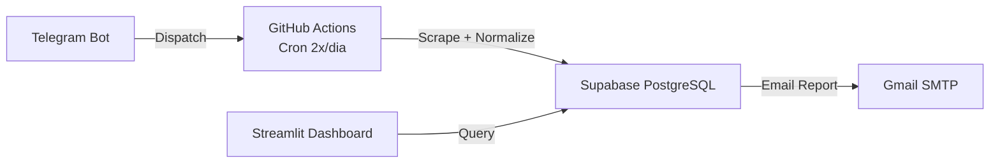

# CustoDoce - Memória do Projeto

## Sobre
Projeto de busca e comparação de preços de ingredientes para confeitaria.
Foco na Baixada Santista (Santos, São Vicente, Praia Grande, Mongaguá, Itanhaém, Peruíbe)
e São Paulo Capital. Infraestrutura 100% gratuita.

## Stack
- **DB/API**: Supabase (PostgreSQL) - 500MB free
- **Scrapers**: GitHub Actions (Python, 2.000 min/mês)
- **Dashboard**: Streamlit Cloud (Python, 1 app privado grátis)
- **Bot**: Telegram (python-telegram-bot)
- **Email**: Gmail SMTP (500 e-mails/dia)
- **AI/ML**: Sentence-Transformers (ONNX), Groq API, Scikit-learn (Isolation Forest)
- **Total Free Tier**: R$ 0,00

## Arquitetura



## Estrutura de Diretórios

```
CustoDoce/
├── .github/workflows/
│   ├── scrape.yml                   # Coleta automática (cron + deploy)
│   ├── ci.yml                       # CI: 7 jobs (lint → typecheck → unit → integration → schema → deploy-check → real)
│   ├── e2e.yml                      # E2E quinzenal (Playwright + visual regression)
│   ├── backup.yml                   # Backup semanal pg_dump
│   ├── restore-test.yml             # Teste de restauração mensal
│   ├── deploy-staging.yml           # Deploy para ambiente de staging
│   └── on_demand_scrape.yml         # Scraping manual via workflow_dispatch
├── config/
│   ├── ingredients.yaml             # 23 ingredientes canônicos + aliases + search_terms
│   ├── stores.yaml                  # 51 lojas (Tier 1-4)
│   ├── features.yaml                # Flags declarativas liga/desliga
│   └── schema_prices.json           # Contrato de dados
├── scrapers/
│   ├── base_flyer.py, base_web_scraper.py  # ABCs
│   ├── flyer_scraper.py, flyer_parser.py   # PDF genérico
│   ├── vtex_scraper.py, website_scraper.py, carrefour_scraper.py  # E-commerce
│   ├── tenda_api_scraper.py, roldao_api_scraper.py, roldao_flyer_scraper.py, max_api_scraper.py  # APIs
│   ├── aggregator_scraper.py, playwright_scraper.py, playwright_price_scraper.py  # JS
│   ├── extra_flyer_scraper.py, pao_flyer_scraper.py  # Redes específicas
│   ├── ocr.py, unit_extractor.py
│   └── semantic_matcher.py          # Embeddings sentence-transformers (ONNX + cache)
├── parsers/
│   ├── normalizer.py                # Extrai unidade → R$/kg + R$/un
│   ├── matcher.py                   # token_set_ratio ≥80% (RapidFuzz)
│   ├── brand_extractor.py           # Extrai marca via YAML (3 níveis)
│   ├── llm_cache.py                 # Cache SQLite (TTL 30d) — Recurso 3
│   ├── llm_strategies.py            # Strategy Pattern (Groq/OpenRouter/HF) + Circuit Breaker + JSON Mode — Recurso 2
│   └── llm_classifier.py            # Orquestrador: cache → Groq → OpenRouter → HF → fallback seguro — Recurso 2
├── services/
│   ├── supabase_client.py           # Singleton conexão
│   ├── price_repository.py          # Queries brutas e acesso ao DB
│   ├── price_service.py             # Orquestração CRUD + busca + cleanup
│   ├── price_analytics.py           # Winners, trends, relatórios + otimizar_carrinho_compras (monofonte/multifonte) — Recurso 1
│   ├── price_intelligence.py        # Z-score + Isolation Forest (anomalias/ofertas)
│   ├── review_queue_service.py      # Gestão de aprovação/rejeição de matches
│   ├── collector.py                 # Orquestrador declarativo de coleta (Pipeline)
│   ├── config_db.py                 # DB-backed config (Ingredients/Stores)
│   ├── email_service.py, telegram_service.py, auth.py, rate_limiter.py
│   ├── alert_service.py             # Alertas proativos (ex: ingrediente sem preço > 48h)
│   ├── logger.py                    # Structured Logging (structlog)
│   ├── otel.py                      # Tracing (OpenTelemetry)
│   └── dashboard_queries.py         # Query cache + extract_ppk/pun (single source)
├── dashboard/
│   ├── login_page.py, components/ (ui.py, layout.py)
│   └── pages/                       # 16 módulos (visao_geral, precos, historico, etc.)
├── telegram_bot/
│   └── handlers.py                  # /preco, /lista, /status
├── admin/app.py                     # 107 linhas — importa 17 pages + sidebar + login
├── supabase/
│   ├── seed.sql, consolidated_migration.sql
│   ├── 002_add_brand_column.sql
│   ├── 003_fix_price_history_trigger.sql
│   └── 004_add_llm_match_cache.sql   # Cache persistente de decisões LLM (Recurso 3)
├── scripts/
│   ├── deploy_database.py           # Migração SQL (--dry-run/--execute)
│   ├── deploy_check.py              # Health check pré-deploy
│   ├── validate_db_schema.py        # 87 checks de schema (via RPC)
│   ├── db_audit.py                  # Auditoria completa do DB
│   ├── sync_all_store_fields.py     # Sync stores.yaml ↔ DB + scrape_frequencies
│   ├── send_daily_report.py         # Relatório diário por email
│   ├── seed_prices.py               # Dados sintéticos
│   ├── sync_staging.py              # Sync Prod → Staging
│   ├── seed_staging.py              # Seed de teste para Staging
│   ├── validate_staging.py          # Health check do ambiente Staging
│   ├── run_quality_gates.py         # Great Expectations suite (5 expectations)
│   ├── sanity_check.py              # Sanity check pré-coleta
│   ├── sync_docs.py                 # Sincronização de documentação
│   ├── validate_production.py       # Validação completa de produção
│   ├── full_prod_validation.py      # Validador multi-fase (0-6)
│   ├── validation_phases/           # 7 módulos (phase0_static → phase6_health)
│   ├── archive/                     # 28 scripts históricos
│   └── ... (+20 scripts utilitários)
├── tests/
│   ├── unit/                        # 383 testes mockados (dashboard + services + llm)
│   ├── schema/                      # 94 parametrized (tables, columns, constraints, indexes, functions)
│   ├── integration/                 # 13 files — Benchmarks + DB integration (via RPC)
│   ├── e2e/                         # 4 files — Playwright E2E (estabilidade UI, 0 collected sem setup)
│   └── real/                        # 3 files — Scrapers reais (slow, flaky)
├── main.py                          # Orquestrador: collect + cleanup + intelligence loop
├── pyproject.toml                   # Ruff (120 chars), mypy (3.12), pytest config
├── requirements.txt                 # Runtime: pdfplumber, supabase, streamlit, groq, torch, etc.
├── requirements-dev.txt             # ruff, bandit, pip-audit, mypy, pytest, psycopg2-binary
└── data/prices_latest.json          # Snapshot da última coleta
```

## Tiers de Lojas

| Tier | Tipo | Frequência | Como coleta |
|------|------|------------|-------------|
| 1 | PDF Direto (9 redes atacadistas) | Semanal (quarta/quinta) | pdfplumber + OCR fallback |
| 2a | E-commerce SP (VTEX API) | Diária | requests API |
| 2b | Atacado Físico SP (Manos, Jabaquara etc.) | Mensal | Manual - visita + planilha |
| 3 | Agregadores (Tiendeo, Guiato) | Fallback | Playwright / SSR |
| 4 | Manual (WhatsApp, visita local) | Sob demanda | Planilha .xlsx |

## Ingredientes Monitorados (23)

| # | Ingrediente | Categoria | Brands |
|---|-------------|-----------|--------|
| 1 | Leite Condensado Integral | lacteos | Moça, Piracanjuba, Italac, Itambé |
| 2 | Creme de Leite 20% Gordura | lacteos | Nestlé, Piracanjuba |
| 3 | Chocolate em Pó 50% Cacau | chocolates | Melken, Sicao |
| 4 | Leite em Pó Integral | lacteos | Ninho |
| 5 | Granulado Ao Leite | confeitos | Melken |
| 6 | Granulado Branco | confeitos | Melken |
| 7 | Granulado Meio Amargo | confeitos | Melken |
| 8 | Creme de Avelã | pastas | Nutella |
| 9 | Granulado Colorido | confeitos | Coloretti |
| 10 | Coco Ralado Grosso s/ Açúcar | secos | Socôco, Ducoco |
| 11 | Chocolate Nobre Blend | chocolates | Harald |
| 12 | Açúcar Mascavo | acucares | JR |
| 13 | Açúcar de Confeiteiro | acucares | Mavalerio |
| 14 | Chocolate em Pó 70% Cacau | chocolates | Sicao |
| 15 | Farinha de Trigo | farinhas | Dona Benta |
| 16 | Micro Ball | confeitos | Mavalerio |
| 17 | Top Confete Morango | confeitos | Harald |
| 18 | Gotas de Chocolate Branco | chocolates | Melken |
| 19 | Manteiga | lacteos | Aviação, Delícia, Itambé, Piracanjuba, Batavo, Vigor, Presidente, Tirolez |
| 20 | Gotas de Chocolate Meio Amargo | chocolates | Harald, Melken |
| 21 | Chocolate Meio Amargo em Barra | chocolates | Harald, Callebaut, Garoto |
| 22 | Fermento Químico em Pó | farinhas | Royal, Dona Benta |
| 23 | Essência de Baunilha | essencias | Mavalerio, Coza, Dr.Oetker |

## Fluxo de Coleta (GitHub Actions scrape.yml)

```
main.py → sync_store_fields() → para cada loja ativa:
  Tier 1 (PDF): build_url → HEAD (ETag) → download → MD5 cache → pdfplumber → OCR fallback
  Tier 2a (VTEX): GET api/products/search?ft= → parse JSON
  Tier 3 (site): GET /busca?q= → selectolax CSS selectors
  Todos → process_price_match():
    → match_ingredient() [exact → alias → word_subset → fuzzy RapidFuzz ≥80%]
    → se ≥80%: upsert_price_rpc() (server-side upsert via Supabase RPC)
    → se 55-79%: semantic_matcher blend (RapidFuzz 0.6 + embeddings 0.4)
    → se 65-80%: llm_classifier (Groq)
    → se <55%: review_queue com match_type, match_reason, brand, top3 candidatos
  Sexta/sábado (opcional): Playwright agregadores + OCR fila
  Fim: enrich_prices() [Isolation Forest] → commit data/prices_latest.json → send_daily_report.py (email)
  Processamento Extra: process_ocr_queue() → alert_service.process_proactive_alerts()
  1º do mês: release GitHub com snapshot .json.gz
```

## Matcher (parsers/matcher.py)

1. **Exato**: canonical name no texto do produto
2. **Apelido exato**: cada alias com `in` operator
3. **Contido**: todas as palavras do canonical no produto
4. **Fuzzy**: RapidFuzz `fuzz.token_set_ratio(product, canonical/alias)` ≥80%
5. **Match types PT**: `exato` / `proximo_nome` / `proximo_apelido` / `contido`
6. **Confidence Score**: 1.0 (exato), 0.8-1.0 (fuzzy ≥80%), <0.8 (review queue)
7. **Brand extraction**: 3 níveis (exato → substring regex → fuzzy palavra a palavra ≥80%)
8. **Review Queue**: items <80% vão pra `review_queue` com `match_type`, `match_reason`, `top3` candidatos, `brand`

## Normalizer (parsers/normalizer.py)

```
"cx 12x395g" → qty=12, unit_kg=0.395, total_kg=4.74
"2kg"        → qty=1,  unit_kg=2.0,   total_kg=2.0
"500g"       → qty=1,  unit_kg=0.5,   total_kg=0.5
"12un 395g"  → qty=12, unit_kg=0.395, total_kg=4.74
"lata 1kg"   → qty=1,  unit_kg=1.0,   total_kg=1.0

price_per_kg = raw_price / total_kg
price_per_un = raw_price / qty
```

## Tratamento de Erros

| Erro | Ação |
|------|------|
| PDF 404 | Loga aviso, pula loja |
| Timeout | Retry 2x, depois pula |
| ETag não mudou | Pula (cache hit) |
| pdfplumber vazio | OCR fallback (Tesseract) |
| Matcher <80% | Review queue (com match_reason detalhado) |
| Supabase offline | Salva em prices_latest.json local |
| Email falha | Loga erro, não bloqueia pipeline |
| Porta 5432 bloqueada | Usa exec_sql_query RPC (porta 443) |

## ⚠️ Regra Obrigatória: DB Sync

**Toda alteração em SQL/funções/triggers deve ser verificada na base real do Supabase antes de dar como concluída.** Usar REST API (RPC `exec_sql_query`), NÃO psycopg2 direto.

```bash
# Deploy e verificação via RPC (porta 443, funciona de qualquer rede)
python scripts/deploy_database.py --execute
# Teste comportamental
python -c "
from supabase import create_client; import os
s = create_client(os.environ['SUPABASE_URL'], os.environ['SUPABASE_SERVICE_ROLE_KEY'])
r1 = s.rpc('upsert_price_rpc', {...}).execute()
r2 = s.rpc('upsert_price_rpc', {...}).execute()
assert r1.data.get('id') == r2.data.get('id')  # dedup
"
# Rodar testes
ruff check . && python -m pytest tests/unit/ tests/schema/ -q
```

## Comandos Relevantes

```bash
# Lint + type + test
ruff check . && python -m mypy . && python -m pytest tests/unit/ tests/schema/ -q

# Testar scraper manualmente
python -c "from scrapers.base_flyer import BaseFlyerScraper; s = BaseFlyerScraper({'name':'Assaí','url_pattern':'...'}); print(s.run())"

# Testar normalizer
python -c "from parsers.normalizer import normalize_price; print(normalize_price(42.90, 'cx 12x395g'))"

# Testar matcher
python -c "from parsers.matcher import match_ingredient; ing = [{'canonical':'Leite Condensado','aliases':[]}]; print(match_ingredient('Leite Condensado Moça 12un', ing))"

# Schema validation (via REST API, precisa .env com credenciais)
python scripts/validate_db_schema.py

# Migração SQL
python scripts/deploy_database.py --dry-run

# Gerar dados sintéticos
python scripts/seed_prices.py --dry-run
```

## Status Atual
 
**Fase 8 concluída (Full Project Overhaul).** 
- LLM Resilience + Cache (Strategy Pattern, Circuit Breaker, 3 providers) ✅
- Cart Optimizer (Monofonte/Multifonte) ✅
- Capacity Planning Dashboard ✅
- Staging Environment + CI/CD Unification ✅
- Observabilidade (structlog + OTel) ✅
- Feature Flags per-ingredient ✅
 
| Ferramenta | Status |
|------------|--------|
| pytest (unit) | **477 passing** | ✅ |
| pytest (schema) | **94 passing** | ✅ |
| pytest (integration) | 100 tests | ⏳ |
| pytest (e2e) | 0 collected (Playwright setup needed) | ⏳ |
| pytest (real) | 6 tests (slow/flaky) | ⏳ |

## Ambiente

- **Padrão: Windows** (PowerShell) — pytest/ruff/mypy rodam direto
- **WSL (Debian)**: só para testes Linux-específicos (Playwright, OCR, scrapers reais, CI pipeline)
