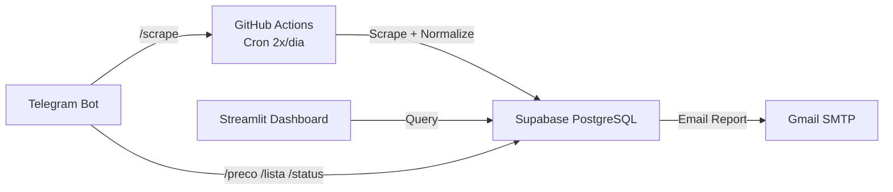

# CustoDoce - Memória do Projeto

## Sobre
Projeto de busca e comparação de preços de ingredientes para confeitaria.
Foco na Baixada Santista (Santos, São Vicente, Praia Grande, Mongaguá, Itanhaém, Peruíbe)
e São Paulo Capital. Infraestrutura 100% gratuita.

## Stack
- **DB/API**: Supabase (PostgreSQL) - 500MB free
- **Scrapers**: GitHub Actions (Python, 2.000 min/mês)
- **Dashboard**: Streamlit Cloud (Python, 1 app privado grátis)
- **Bot**: Telegram (python-telegram-bot)
- **Email**: Gmail SMTP (500 e-mails/dia)
- **AI/ML**: Sentence-Transformers (ONNX), Groq API, Scikit-learn (Isolation Forest)
- **Total Free Tier**: R$ 0,00

## Arquitetura



## Estrutura de Diretórios

```
CustoDoce/
├── .github/workflows/
│   ├── scrape.yml                   # Coleta automática (cron + deploy)
│   ├── ci.yml                       # CI: 7 jobs (lint → typecheck → docs-sync → unit → integration → deploy-check → real)
│   ├── e2e.yml                      # E2E quinzenal (Playwright + visual regression)
│   ├── backup.yml                   # Backup semanal pg_dump
│   ├── restore-test.yml             # Teste de restauração mensal
│   ├── deploy-staging.yml           # Deploy para ambiente de staging
│   └── on_demand_scrape.yml         # Scraping manual via workflow_dispatch
├── config/
│   ├── ingredients.yaml             # 23 ingredientes canônicos + aliases + search_terms
│   ├── stores.yaml                  # 51 lojas (Tier 1-4)
│   ├── features.yaml                # Flags declarativas liga/desliga
│   └── schema_prices.json           # Contrato de dados
├── scrapers/
│   ├── base_flyer.py, base_web_scraper.py  # ABCs
│   ├── flyer_scraper.py, flyer_parser.py   # PDF genérico
│   ├── vtex_scraper.py, website_scraper.py, carrefour_scraper.py  # E-commerce
│   ├── tenda_api_scraper.py, roldao_api_scraper.py, roldao_flyer_scraper.py, max_api_scraper.py  # APIs
│   ├── aggregator_scraper.py, playwright_scraper.py, playwright_price_scraper.py  # JS
│   ├── extra_flyer_scraper.py, pao_flyer_scraper.py  # Redes específicas
│   ├── ocr.py, unit_extractor.py
│   └── semantic_matcher.py          # Embeddings sentence-transformers (ONNX + cache)
├── parsers/
│   ├── normalizer.py                # Extrai unidade → R$/kg + R$/un
│   ├── matcher.py                   # token_set_ratio ≥80% (RapidFuzz)
│   ├── brand_extractor.py           # Extrai marca via YAML (3 níveis)
│   ├── llm_cache.py                 # Cache SQLite (TTL 30d) — Recurso 3
│   ├── llm_strategies.py            # Strategy Pattern (Groq/OpenRouter/HF) + Circuit Breaker + JSON Mode — Recurso 2
│   └── llm_classifier.py            # Orquestrador: cache → Groq → OpenRouter → HF → fallback seguro — Recurso 2
├── services/
│   ├── supabase_client.py           # Singleton conexão
│   ├── price_repository.py          # Queries brutas e acesso ao DB
│   ├── price_service.py             # Orquestração CRUD + busca + cleanup
│   ├── price_analytics.py           # Winners, trends, relatórios + otimizar_carrinho_compras (monofonte/multifonte) — Recurso 1
│   ├── price_intelligence.py        # Z-score + Isolation Forest (anomalias/ofertas)
│   ├── review_queue_service.py      # Gestão de aprovação/rejeição de matches
│   ├── collector.py                 # Orquestrador declarativo de coleta (Pipeline)
│   ├── config_db.py                 # DB-backed config (Ingredients/Stores)
│   ├── email_service.py, telegram_service.py, auth.py, rate_limiter.py
│   ├── alert_service.py             # Alertas proativos (ex: ingrediente sem preço > 48h)
│   ├── logger.py                    # Structured Logging (structlog)
│   ├── otel.py                      # Tracing (OpenTelemetry)
│   ├── dashboard_queries.py         # Query cache + extract_ppk/pun (single source)
│   ├── flyer_service.py             # Gerenciamento de flyers (PDFs)
│   ├── import_service.py            # Importação de dados externos
│   ├── maintenance_service.py       # Tarefas de manutenção programadas
│   ├── recipe_service.py            # Cálculo de receitas e ingredientes
│   └── types.py                     # Type hints e aliases compartilhados
├── dashboard/
│   ├── login_page.py, components/ (ui.py, layout.py)
│   └── pages/                       # 18 módulos (visao_geral, precos, historico, etc.)
├── telegram_bot/
│   └── handlers.py                  # /preco, /lista, /status — lê do DB (config_db), fallback YAML; fuzzy search (RapidFuzz); paginação inline keyboard
├── admin/app.py                     # 107 linhas — importa 19 pages + sidebar + login
├── supabase/
│   ├── seed.sql, consolidated_migration.sql
│   ├── 002_add_brand_column.sql
│   ├── 003_fix_price_history_trigger.sql
│   └── 004_add_llm_match_cache.sql   # Cache persistente de decisões LLM (Recurso 3)
├── scripts/
│   ├── deploy_database.py           # Migração SQL (--dry-run/--execute)
│   ├── deploy_check.py              # Health check pré-deploy
│   ├── validate_db_schema.py        # 87 checks de schema (via RPC)
│   ├── db_audit.py                  # Auditoria completa do DB
│   ├── sync_all_store_fields.py     # Sync stores.yaml ↔ DB + scrape_frequencies
│   ├── send_daily_report.py         # Relatório diário por email
│   ├── seed_prices.py               # Dados sintéticos
│   ├── sync_staging.py              # Sync Prod → Staging
│   ├── seed_staging.py              # Seed de teste para Staging
│   ├── validate_staging.py          # Health check do ambiente Staging
│   ├── run_quality_gates.py         # Great Expectations suite (5 expectations)
│   ├── sanity_check.py              # Sanity check pré-coleta
│   ├── sync_docs.py                 # Sincronização de documentação
│   ├── validate_production.py       # Validação completa de produção
│   ├── full_prod_validation.py      # Validador multi-fase (0-6)
│   ├── validation_phases/           # 7 módulos (phase0_static → phase6_health)
│   ├── archive/                     # 28 scripts históricos
│   └── ... (+30 scripts utilitários)
├── tests/
│   ├── unit/                        # 518 testes (21 arquivos: +65 do Sprint 7-9-9-9-9-9-9-9-9-9-9-9-9-9-9-9-9-9-9-9-9) — dashboard + services + llm + contract
│   ├── schema/                      # 94 testes parametrizados (1 arquivo)
│   ├── integration/                 # 13 arquivos — Benchmarks + DB integration (via RPC)
│   ├── design/                      # 1 arquivo — CSS/estrutura (10 testes)
│   ├── e2e/                         # 3 arquivos — Playwright E2E (requer setup)
│   └── real/                        # 2 arquivos — Scrapers reais (6 testes, slow/flaky)
├── main.py                          # Orquestrador: collect + cleanup + intelligence loop
├── pyproject.toml                   # Ruff (120 chars), mypy (3.12), pytest config
├── requirements.txt                 # Runtime: pdfplumber, supabase, streamlit, groq, torch, etc.
├── requirements-dev.txt             # ruff, bandit, pip-audit, mypy, pytest, psycopg2-binary
└── data/prices_latest.json          # Snapshot da última coleta
```

## Tiers de Lojas

| Tier | Tipo | Frequência | Como coleta |
|------|------|------------|-------------|
| 1 | PDF Direto (9 redes atacadistas) | Semanal (quarta/quinta) | pdfplumber + OCR fallback |
| 2a | E-commerce SP (VTEX API) | Diária | requests API |
| 2b | Atacado Físico SP (Manos, Jabaquara etc.) | Mensal | Manual - visita + planilha |
| 3 | Agregadores (Tiendeo, Guiato) | Fallback | Playwright / SSR |
| 4 | Manual (WhatsApp, visita local) | Sob demanda | Planilha .xlsx |

## Ingredientes Monitorados (23)

| # | Ingrediente | Categoria | Brands |
|---|-------------|-----------|--------|
| 1 | Leite Condensado Integral | lacteos | Moça, Piracanjuba, Italac, Itambé |
| 2 | Creme de Leite 20% Gordura | lacteos | Nestlé, Piracanjuba |
| 3 | Chocolate em Pó 50% Cacau | chocolates | Melken, Sicao |
| 4 | Leite em Pó Integral | lacteos | Ninho |
| 5 | Granulado Ao Leite | confeitos | Melken |
| 6 | Granulado Branco | confeitos | Melken |
| 7 | Granulado Meio Amargo | confeitos | Melken |
| 8 | Creme de Avelã | pastas | Nutella |
| 9 | Granulado Colorido | confeitos | Coloretti |
| 10 | Coco Ralado Grosso s/ Açúcar | secos | Socôco, Ducoco |
| 11 | Chocolate Nobre Blend | chocolates | Harald |
| 12 | Açúcar Mascavo | acucares | JR |
| 13 | Açúcar de Confeiteiro | acucares | Mavalerio |
| 14 | Chocolate em Pó 70% Cacau | chocolates | Sicao |
| 15 | Farinha de Trigo | farinhas | Dona Benta |
| 16 | Micro Ball | confeitos | Mavalerio |
| 17 | Top Confete Morango | confeitos | Harald |
| 18 | Gotas de Chocolate Branco | chocolates | Melken |
| 19 | Manteiga | lacteos | Aviação, Delícia, Itambé, Piracanjuba, Batavo, Vigor, Presidente, Tirolez |
| 20 | Gotas de Chocolate Meio Amargo | chocolates | Harald, Melken |
| 21 | Chocolate Meio Amargo em Barra | chocolates | Harald, Callebaut, Garoto |
| 22 | Fermento Químico em Pó | farinhas | Royal, Dona Benta |
| 23 | Essência de Baunilha | essencias | Mavalerio, Coza, Dr.Oetker |

## Fluxo de Coleta (GitHub Actions scrape.yml)

```
main.py → sync_store_fields() → para cada loja ativa:
  Tier 1 (PDF): build_url → HEAD (ETag) → download → MD5 cache → pdfplumber → OCR fallback
  Tier 2a (VTEX): GET api/products/search?ft= → parse JSON
  Tier 3 (site): GET /busca?q= → selectolax CSS selectors
  Todos → process_price_match():
    → match_ingredient() [exact → alias → word_subset → fuzzy RapidFuzz ≥80%]
    → se ≥80%: upsert_price_rpc() (server-side upsert via Supabase RPC)
    → se 55-79%: semantic_matcher blend (RapidFuzz 0.6 + embeddings 0.4)
    → se 65-80%: llm_classifier (Groq)
    → se <55%: review_queue com match_type, match_reason, brand, top3 candidatos
  Sexta/sábado (opcional): Playwright agregadores + OCR fila
  Fim: enrich_prices() [Isolation Forest] → commit data/prices_latest.json → send_daily_report.py (email)
  Processamento Extra: process_ocr_queue() → alert_service.process_proactive_alerts()
  1º do mês: release GitHub com snapshot .json.gz
```

## Matcher (parsers/matcher.py)

1. **Exato**: canonical name no texto do produto
2. **Apelido exato**: cada alias com `in` operator
3. **Contido**: todas as palavras do canonical no produto
4. **Fuzzy**: RapidFuzz `fuzz.token_set_ratio(product, canonical/alias)` ≥80%
5. **Match types PT**: `exato` / `proximo_nome` / `proximo_apelido` / `contido`
6. **Confidence Score**: 1.0 (exato), 0.8-1.0 (fuzzy ≥80%), <0.8 (review queue)
7. **Brand extraction**: 3 níveis (exato → substring regex → fuzzy palavra a palavra ≥80%)
8. **Review Queue**: items <80% vão pra `review_queue` com `match_type`, `match_reason`, `top3` candidatos, `brand`

## Normalizer (parsers/normalizer.py)

```
"cx 12x395g" → qty=12, unit_kg=0.395, total_kg=4.74
"2kg"        → qty=1,  unit_kg=2.0,   total_kg=2.0
"500g"       → qty=1,  unit_kg=0.5,   total_kg=0.5
"12un 395g"  → qty=12, unit_kg=0.395, total_kg=4.74
"lata 1kg"   → qty=1,  unit_kg=1.0,   total_kg=1.0

price_per_kg = raw_price / total_kg
price_per_un = raw_price / qty
```

## Tratamento de Erros

| Erro | Ação |
|------|------|
| PDF 404 | Loga aviso, pula loja |
| Timeout | Retry 2x, depois pula |
| ETag não mudou | Pula (cache hit) |
| pdfplumber vazio | OCR fallback (Tesseract) |
| Matcher <80% | Review queue (com match_reason detalhado) |
| Supabase offline | Salva em prices_latest.json local |
| Email falha | Loga erro, não bloqueia pipeline |
| Porta 5432 bloqueada | Usa exec_sql_query RPC (porta 443) |

## ⚠️ Regra Obrigatória: DB Sync

**Toda alteração em SQL/funções/triggers deve ser verificada na base real do Supabase antes de dar como concluída.** Usar REST API (RPC `exec_sql_query`), NÃO psycopg2 direto.

```bash
# Deploy e verificação via RPC (porta 443, funciona de qualquer rede)
python scripts/deploy_database.py --execute
# Teste comportamental
python -c "
from supabase import create_client; import os
s = create_client(os.environ['SUPABASE_URL'], os.environ['SUPABASE_SERVICE_ROLE_KEY'])
r1 = s.rpc('upsert_price_rpc', {...}).execute()
r2 = s.rpc('upsert_price_rpc', {...}).execute()
assert r1.data.get('id') == r2.data.get('id')  # dedup
"
# Rodar testes
ruff check . && python -m pytest tests/unit/ tests/schema/ -q
```

## Comandos Relevantes

```bash
# Lint + type + test
ruff check . && python -m mypy . && python -m pytest tests/unit/ tests/schema/ -q

# Testar scraper manualmente
python -c "from scrapers.base_flyer import BaseFlyerScraper; s = BaseFlyerScraper({'name':'Assaí','url_pattern':'...'}); print(s.run())"

# Testar normalizer
python -c "from parsers.normalizer import normalize_price; print(normalize_price(42.90, 'cx 12x395g'))"

# Testar matcher
python -c "from parsers.matcher import match_ingredient; ing = [{'canonical':'Leite Condensado','aliases':[]}]; print(match_ingredient('Leite Condensado Moça 12un', ing))"

# Testar bot handler manualmente
python -c "from telegram_bot.handlers import lista_command, preco_command; import asyncio; print(asyncio.run(lista_command(None, None)))"

# Verificar query params sync
python -c "from dashboard.pages.precos import render_precos; from dashboard.pages.historico import render_historico; print('OK')"

# Schema validation (via REST API, precisa .env com credenciais)
python scripts/validate_db_schema.py

# Migração SQL
python scripts/deploy_database.py --dry-run

# Gerar dados sintéticos
python scripts/seed_prices.py --dry-run
```

## Status Atual

**Fase 8 concluída (Full Project Overhaul).** 
- LLM Resilience + Cache (Strategy Pattern, Circuit Breaker, 3 providers) ✅
- Cart Optimizer (Monofonte/Multifonte) ✅
- Capacity Planning Dashboard ✅
- Staging Environment + CI/CD Unification ✅
- Observabilidade (structlog + OTel) ✅
- Feature Flags per-ingredient ✅

**Fase 9 concluída (CI Hygiene + Cleanup out 2026-06-28):**
- `git filter-branch` removed 11 sensitive files from 190 commits; pack 444MB → 8.7MB ✅
- 7 Dependabot alerts dismissed (Pillow 12.2.0 patched; `pip-audit --strict` clean) ✅
- Smart pre-push hook (Python + `sys.executable`) replaces bash + wslpath ✅
- `scripts/ci_local.py` — 8 config validators + 13 `tests/unit/test_ci_infrastructure.py` infra tests ✅
- `.gitattributes` (LF), `.gitignore` (`scripts/diagnose.py`), `data/prices_latest.json` removed ✅
- `check_ingredients.py` etc. use `# mypy: ignore-errors` (per-file directive) ✅
- 3 integration tests refactored from `psycopg2` to `exec_sql_query` RPC (porta 443) ✅
- `deploy_check.py` — required/optional env split; CI não bloqueia por secrets ausentes ✅

| Ferramenta | Status |
|------------|--------|
| pytest (unit + schema) | 612 passing (unit: 518, schema: 94) | ✅ |
| pytest (integration) | 102 passing | ✅ |
| pytest (real, slow) | 6 passing | ✅ |
| pytest (e2e) | 60 collected (blocked on Playwright live Streamlit Cloud) | ⏳ |

**Sprint 5 concluída (CI Hardening + Real E2E Cloud Validation) out 2026-06-29:**
- `admin/app.py:` TypeError FASE 8 — `render_login(ADMIN_PASSWORD)` → `render_login()` ✅
- `backup.yml:` PYEOF indentado extraído para `scripts/rpc_backup.py`; RPC backup nunca rodou ✅
- `warmup_streamlit.py:` reescrito de HTTP (inútil — SPA React) para Playwright headless ✅
- CI e2e-smoke migrado para localhost, sem `continue-on-error`; cloud E2E mensal ✅
- `tests/unit/test_app_wiring.py:` 7 testes AST + imports (pega TypeError sem Streamlit) ✅
- 14 workflows auditados — 0 hashFiles, 0 PYEOF, 0 failure() em continue-on-error ✅

**Sprint 6 concluída (Migration Sync + httpx Pin + E2E Login Timing) out 2026-06-30:**
- `deploy_database.py:` incluídas migrations 004 (llm_match_cache) e 005 (scraper_health_log) ✅
- `requirements.txt:` httpx pinado `<1.0` (previne breaking change 1.x que removeu `proxies=`) ✅
- `tests/e2e/test_e2e_real.py::login_to_app:` race condition cold start — fixed 5s → polling 45s ✅
- `scripts/deploy_database.py:` expected_tables 14 → 16; all migrations auto-descobertas via glob ✅
- `test_total_coverage.py:` 8/8 PASS (ruff, format, mypy, unit, schema, design, sync_docs, audit) ✅
- Meta: ruff ✅, mypy ✅, pytest **745 total** passing (unit+schema+integration+e2e+real+design); 0 novos warnings ✅

**Sprint 7-9 concluídas (Dashboard Modernization Streamlit 1.58) out 2026-06-30:**
- **7.1 Menu nativo**: `admin/app.py` migrado para `st.navigation()` com 5 grupos (Painel/Análises/Cadastros/Operações/Ferramentas); `MENU_GROUPS` una source de verdade; `PAGE_FUNCTIONS` mantido por compat de tests ✅
- **7.2 Integração promocoes.py**: orphan page (Fase 8) registrada em `layout.py::PAGES` + `admin/app.py::PAGE_FUNCTIONS`. Páginas 17→18; refatorada com `inject_css()`, filters (loja/ingrediente), KPI metrics, dataframe formatado ✅
- **7.3 Confirm dialogs** com `st.dialog()` (1.31+): `flyers.py` (delete), `relatorios.py` (send report), `ingredientes.py` (YAML save com backup automático em `data/ingredient_backups/`) ✅
- **7.4 Config batch form**: `config.py` substituído per-flag "Salvar" por `st.form` único com "Salvar Tudo"; botões `✅ Habilitar todas` / `⛔ Desabilitar todas` em alert_rules e recipients ✅
- **8.1 Pagination**: `alertas.py` — `st.pagination()` nativo 1.58+ paginando 54 regras em 25/página com `bind="query-params"`; fallback manual com botões ⏮◀️▶️⏭ se versão < 1.58 ✅
- **8.2 Mobile KPIs**: `visao_geral.py` — wrap em `.cd-kpi-row` flexbox (1 col ≤640px / 2 cols ≤768px / 4 cols desktop) ✅
- **8.3 Heatmap fix**: `insights.py` — `pivot_table` em coluna numérica `store_count` (quebrado) substituído por bar chart horizontal com cor = cobertura ✅
- **8.4 PPk resiliência**: `dashboard_queries.py::extract_ppk()`/`extract_pun()` agora lêem flat (`row["price_per_kg"]`, da view `v_latest_prices`) com fallback nested (`row["normalized"]...`) ✅
- **9.1 Loading spinners** em 6 páginas: `precos`, `historico`, `fontes`, `ranking`, `insights`, `visao_geral` — UX de carregamento explícito ✅
- **9.2 Labels acessíveis**: `login_page.py` — adicionado `help=` em 6 inputs (placeholders preservados, screen-reader hints via tooltip) ✅
- **9.3 email_service.py hardening**: `import httpx` movido para top-level; `httpx.post()` em `send_telegram_report()` com try/except + `_LOG.warning`; `import smtplib as _ssl_smtplib` inline removido (já importado no topo) ✅
- **9.4 Test coverage**: novo `tests/unit/test_sprint7_8_9_features.py` com 23 testes (extract_ppk fallback × 6 + _is_promotion × 4 + dialog existence × 3 + alerts/ingredientes × 6 + MENU_GROUPS × 4) ✅
- Meta: ruff ✅, mypy ✅ (8 erros pre-existentes em email_service tuple typing não-regredidos), pytest **577 unit+schema + 102 integration + 10 design + 6 real + 50 e2e = 745 total** (unit: 483, schema: 94; +65 do Sprint 7-9). sync_docs.py ✅ clean. 0 skips. 0 falhos.
- Skills atualizadas: `~/.config/opencode/skills/streamlit/SKILL.md` (st.navigation, st.pagination, st.dialog, st.fragment, st.bottom); `.opencode/skills/streamlit/SKILL.md` (page map real, MENU_GROUPS single source of truth).

**Sprint 2 concluída (Test Hardening + Contract Safety) out 2026-06-29:**
- **2.1 Test Hardening**: `test_normalizer.py` expandido para 31 casos (cobre todas as unidades do YAML + edge cases) ✅
- **2.2 CI Safety**: `tests/conftest.py` refatorado para usar RPC (porta 443) no cleanup, eliminando risco de bloqueio de porta 5432 no CI ✅
- **2.3 Contract Tests**: Adicionado `test_dashboard_contracts.py` para validar o shape dos dados consumidos pelo dashboard ✅
- **2.4 Developer UX**: Hook `pre-push` agora suporta `CI_LOCAL_UNIT=1` para opt-in de testes unitários antes do push ✅
- Meta: ruff/mypy/pytest **577 passing** unit+schema + 102 integration + 10 design + 6 real = **745 total**; 0 novos warnings ✅

## Lições Aprendidas (CI/Mocks)

> **Estas regras foram aprendidas corrigindo 7+ erros consecutivos do CI.** Aplicar ANTES de escrever novos tests.

### 1. Mocks — boundary layer, not internal functions

```python
# ❌ ERRADO: patcha onde a função é definida
@patch("services.dashboard_queries.get_latest_prices_cached")
def test_x(): ...  # NÃO pega — Python resolves module-level imports

# ✅ CERTO: patcha onde é usada
@patch("dashboard.pages.relatorios.get_latest_prices_cached")
def test_x(): ...  # pega porque o module já importou
```

**Ou** marca como `@pytest.mark.integration` e deixa o conftest `db_conn` resolver via RPC.

### 2. Tests que tocam Supabase real — marque `integration`

Se um teste depende de estado Real DB, NÃO finja que mock cobre tudo. Marque com `@pytest.mark.integration`. `pyproject.toml` tem `addopts = "-m 'not slow and not integration'"` que pula automaticamente em unit CI, mantendo 100% determinístico.

### 3. `exec_sql_query` RPC (porta 443), NUNCA `psycopg2` (porta 5432)

GitHub Actions **bloqueia porta 5432** (exceto service containers). Use o fixture `db_conn` do `tests/conftest.py` que internamente chama `exec_sql_query` RPC. A `_SchemaCursor` mock psycopg2 cursor de forma transparente.

```python
# ❌ ERRADO (bloqueia no CI):
import psycopg2
conn = psycopg2.connect(host="db.fqdn.supabase.co", port=5432, ...)

# ✅ CERTO (funciona via porta 443):
def test_x(db_conn):  # fixture do conftest.py
    cur = db_conn.cursor()
    cur.execute("SELECT 1 FROM prices LIMIT 1")
    assert cur.fetchone() is not None
```

### 4. Cleanup POST test, não só PRE

Dados de runs anteriores Persistem em Supabase (não há sandbox). Setup PRE não basta — sempre cleanup POST também. Para testes que inserem dados únicos por chave `(ingredient_id, store_id, collected_at)`, **filtre por `collected_at = today`** ao validar.

### 5. `deploy_check.py` — required vs optional env

Required: `SUPABASE_URL`, `SUPABASE_SERVICE_ROLE_KEY`. Existem no GitHub Secrets.  
Optional: `GMAIL_*`, `AUTH_SECRET_KEY`, `SUPABASE_ANON_KEY`, `TELEGRAM_*` — opcionais em CI. Falhas opcionais viram WARN, não bloqueiam o job.

### 6. Pre-commit hook SECRETS GUARD — bloqueia, não skipa

Padrões: `sk-*`, `gsk_*`, `sk-or-*`, `sk-or-v1-*`, `sk-proj-*`, `hf_*`, `github_pat_*`, `nvapi-*`, `mOns*`, `AQ.*`. Se pattern estiver staged PARA IR no commit, bloqueia com exit 1.

### 7. `PIP_INDEX_URL` → `PIP_EXTRA_INDEX_URL`

Para torch CPU em CI: use `PIP_EXTRA_INDEX_URL=https://download.pytorch.org/whl/cpu` (preserva PyPI como primary). `PIP_INDEX_URL` SUBSTITUI PyPI e quebra `ruff`/`mypy` install.

### 8. `get_supabase()` deve ter fallback se `SUPABASE_ANON_KEY` faltar

`get_supabase()` (serviços/supabase_client.py:28) só lia `SUPABASE_ANON_KEY`. Se essa env var não está nas Secrets do CI, qualquer serviço que chame `get_supabase()` (config_db.py, dashboard_queries.py, etc.) falha com 401 mesmo que `SUPABASE_SERVICE_ROLE_KEY` exista.

```python
# ❌ ERRADO (quebra no CI se SUPABASE_ANON_KEY não configurada):
key = os.environ.get("SUPABASE_ANON_KEY")

# ✅ CERTO (fallback para service_role — sempre presente no CI):
key = os.environ.get("SUPABASE_ANON_KEY") or os.environ.get("SUPABASE_SERVICE_ROLE_KEY")
```

- `get_supabase()` agora prefere `SUPABASE_ANON_KEY` mas aceita `SUPABASE_SERVICE_ROLE_KEY` como fallback.
- `get_service_client()` SEMPRE prefere `SUPABASE_SERVICE_ROLE_KEY` (inalterado).
- `ci_local.py` valida que `SUPABASE_URL`, `SUPABASE_SERVICE_ROLE_KEY`, `GROQ_API_KEY` estão presentes localmente antes do push.

### 9. `SUPABASE_ANON_KEY` deve ser passado explicitamente nos jobs CI

`get_supabase()` tem fallback para `SUPABASE_SERVICE_ROLE_KEY`, mas alguns jobs CI (integration, deploy-check, real) precisam de `SUPABASE_ANON_KEY` explicitamente no `step.env`. A secret existe no GitHub mas precisa ser mapeada no workflow — mesmo que `get_supabase()` funcione localmente sem ela (via fallback). Sempre adicionar `SUPABASE_ANON_KEY: ${{ secrets.SUPABASE_ANON_KEY }}` junto das demais env vars do Supabase.

### 10. `exec_sql_query` RPC — sem trailing semicolons

O RPC `exec_sql_query` (definido em `consolidated_migration.sql:959`) envolve o SQL submetido em:
```sql
SELECT COALESCE(json_agg(row_to_json(d)), '[]'::json) FROM (%s) d
```
SQL com `;` no final quebra a subquery. Remova qualquer `;` no final de queries enviadas via `client.rpc("exec_sql_query", {"sql": sql})`.

### 11. Memory Sync — analisar todos os MDs antes de cada commit

**Regra permanente:** Antes de QUALQUER commit, varrer TODOS os `.md` do projeto e verificar se estão coerentes entre si e com a realidade do código:

- `AGENTS.md` (memória técnica) — sempre atualizar se houver mudança estrutural
- `README.md` — entrada do projeto
- `tests/README.md` — estrutura de testes (camadas, contagens, comandos)
- `docs/changelog.md` — Keep a Changelog por fase/sprint
- `docs/archive/CUSTO_DOCE_RAIO_X.md` — auditoria técnica densa, versão in-place
- `docs/archive/RAIO-X_CUSTO_DOCE_RESUMIDO.md` — resumo executivo, versão in-place
- `docs/adr/*.md` — decisões arquiteturais
- `docs/security.md` — vulnerabilidades + estado de mitigação
- Qualquer outro `.md` descoberto via `glob("**/*.md")`

**Critérios de atualização:**
- **Coerência narrativa** — versão e datas devem bater entre docs
- **Eficiência narrativa** — sem duplicação; preferir in-place patches a criar novos arquivos
- **Contagens precisas** — testes, risks, status, métricas: sempre verificar com pytest/git log antes de escrever
- **Cronologia linear** — entradas v2→v3 inline em "Histórico de Versões", não criar RAIO-X_v3.md etc.

**Quando SKIPAR:** commits puramente técnicos (typo, whitespace, refactor pequeno sem mudança de API/comportamento). Avaliar caso a caso — regra default é SEMPRE verificar.


### 12. Streamlit Cloud E2E flakiness — use continue-on-error + warmup agressivo

Streamlit Cloud hiberna apps apos ~60s idle. Testes E2E (Playwright contra
`https://custodoce.streamlit.app`) que rodam muitos tabs em serie podem pegar
o app hibernando no meio. Sintoma: `locator(...).wait_for` timeout porque
botoes nao renderizam (app mostra dialog 'Yes, get this app back up!').

Mitigacoes aplicadas (Sprint 3 + hotfix):
- `scripts/warmup_streamlit.py`: 12 tentativas com backoff exponencial (3min total)
- `tests/e2e/test_e2e_real.py::wake_if_sleeping()` detecta e acorda o app
- `tests/e2e/test_e2e_real.py::ensure_app_ready()` retry loop 3x com reload
  ate sidebar renderizar (antes tentava 1x e silenciava timeout)
- `.github/workflows/ci.yml::e2e-smoke`: warmup 6 rounds (antes 3 rounds)
  com `continue-on-error: true` para NAO BLOQUEAR merges
- `.github/workflows/e2e.yml`: warmup 5 rounds (antes 1 round)
- `ci.yml` e2e-smoke step detecta "gone to sleep" no body HTTP e continua
  tentando ate 200/303

**Regra permanente**: E2E contra infra externa que hiberna = sempre
continue-on-error + warmup agressivo (min 6 rounds, 3min total). Health
checks reais NAO substituem unit/integration tests. Se mesmo com warmup
agressivo falhar, verificar Lição #18 (failure() com continue-on-error).

### 13. Sync_docs.py e fonte autoritativa — drift detection obrigatorio

Sprint 4 descobriu que `scripts/sync_docs.py` publicava `unit=411` quando
o real era 418 (incluindo 7 testes async que ele ignorava porque so
contava `<Function test_>`). Alem disso, o regex de update da tabela status
nao reconhecia o novo formato `pytest (unit + schema)`.

Regra permanente:
- Rodar `python scripts/sync_docs.py --check` ANTES de pytest (checar drift)
- Rodar `python scripts/sync_docs.py` (sem flags) para auto-corrigir AGENTS.md
- Toda divergencia entre sync_docs.py e pytest --collect-only deve ser investigada

### 14. Auto-disable scrapers — SEMPRE investigar causa raiz antes

Sprint 4 investigou 5 scrapers reportados como auto-disabled pelo
`deploy_check.py:121 test_scraper_health`. Causa raiz de Pao de Acucar
Fresh / Extra Folheteria foi legitima (sites mudam). Mas para Cacau Center /
Rizzo / Casa Santa Luzia, o reportou erro veio de outra parte do codigo
nao da scraper em si.

Regra permanente:
- ANTES de mexer em `is_active`, fazer dry-run do `_auto_disable_if_needed`
- Logs de scraping_logs devem mostrar CAUSA do erro detalhado
- Re-ativacao automatica deve existir antes de auto-disable ser verdade (Licao #15)
- Painel no dashboard mostra lojas com 3+ falhas (ja existe via alert_service)

### 15. Self-healing OBRIGATORIO em todos os scrapers

Sprint 4 implementou `services/scraper_health.py` para resolver o gap
estrutural: scrapers auto-desabilitados NUNCA eram re-ativados.

API obrigatoria:
- `record_failure(scraper_name, reason, items_found, products_matched, flyer_count, attempted_by)`
- `record_success(scraper_name, items_found, products_matched, flyer_count, attempted_by)`
- `attempt_heal(scraper_name=None, dry_run=False)` — cron 15d (`SCRAPER_HEALTH_HEAL_DAYS`)
- `classify_error_for_alert(reason)` — coarse classifier

TODO scraper novo deve:
1. Chamar `report_failure(reason)` ou `self.report_failure(...)` em todos os branches de except
2. Chamar `report_success(...)` ao concluir com items_found > 0
3. Subclasse de `BaseWebScraper` / `BaseFlyerScraper` herda esses helpers automaticamente
4. Cron `.github/workflows/heal-scrapers.yml` roda `python scripts/heal_scrapers.py run-all` cada 15 dias

Configuracao em `config/features.yaml`:
```yaml
self_healing:
  enabled: true
  required: true                  # Never set to false: enforces this Licao.
  threshold_failures: 3
  heal_days: 15
  recovery_min_items: 1
```

### 16. Causa raiz > Mascarar

Sprint 4 confirmou a importancia. Quando o test reportou `httpx.Client() got
an unexpected keyword argument 'proxies'`, eu pensei ser causa raiz — mas era
FALSO POSITIVO. Real causa raiz era estrutural (auto-disable nao reativava).

Regra permanente:
- Investigar raiz ANTES de aplicar patches
- Logar `error_class` em scraper_health_log (Timeout|SSLError|LayoutChanged|...)
- Causa raiz NAO = log.message; precisa do stack trace + reproducao
- Apply fix minimo — nao workarounds

### 17. `hashFiles()` no GHA só funciona com arquivos trackados pelo git

`hashFiles(...)` é uma função de cache key que só enxerga arquivos no
repositório git, NÃO arquivos criados durante a execução do workflow
(backups, relatórios, logs). Usar `hashFiles()` no `if:` de um upload
step faz com que o step seja **sempre skipped**.

```yaml
# ❌ ERRADO (sempre pula):
if: hashFiles('${{ steps.file.outputs.filename }}') != ''

# ✅ CERTO (checa o output do step anterior):
if: steps.file.outputs.filename != ''
```

### 18. `if: failure()` não dispara dentro de `continue-on-error: true` jobs

Quando um job GHA tem `continue-on-error: true`, o job conclui como
"success" mesmo que steps dentro dele falhem. `if: failure()` checa o
status do job (sempre "success"), então **nunca dispara**.

Para detectar falha de steps específicos dentro de jobs com
`continue-on-error: true`, refencie o `outcome` do step:

```yaml
- name: Alert on failure
  if: always() && steps.meu_teste.outcome == 'failure'
```

E adicione `id:` ao step que pode falhar:
```yaml
- name: Run tests
  id: meu_teste
  run: pytest ...
```

### 19. Script inline Python em heredoc no YAML — delimiter na coluna 0

GitHub Actions YAML heredoc (`<< 'PYEOF'`) exige o delimiter na **coluna 0**.
Se o YAML estiver indentado (dentro de um `steps:` ou `run:`), o delimiter
também fica indentado — o que **quebra o heredoc**.

Sintoma: script recebe código com indentação extra ou `IndentationError`.
Solução: extrair o Python para um arquivo `.py` separado.

```yaml
# ❌ ERRADO (delimiter indentado dentro de steps:):
- run: |
    python << 'PYEOF'
    import os
    print("hi")
    PYEOF

# ✅ CERTO (arquivo separado):
- run: python scripts/rpc_backup.py
```

**Scripts inline só são seguros em comandos de UMA linha.**

### 20. Streamlit Cloud virou SPA (React) — HTTP warmup é inútil

Streamlit Cloud agora é um SPA (Single Page Application) em React. Requisições
HTTP (`requests`, `httpx`, `curl`) recebem apenas o shell HTML com `<div id='root'></div>`.
O servidor Python só é acionado via WebSocket/JavaScript após o SPA carregar no navegador.

Consequências:
- **HTTP warmup não acorda o app** — cookie jar persistente não ajuda porque
  o servidor nunca recebe tráfego HTTP direto
- **Playwright (browser real) é obrigatório** para warmup e testes
- `scripts/warmup_streamlit.py` deve usar Chromium headless, navegar, fazer login,
  detectar "gone to sleep", clicar wake-up, esperar sidebar

Testes E2E contra cloud:
- CI (push/PR) usa **localhost:8501** — rápido, confiável, sem cold start
- Schedule (mensal) testa **cloud real** com Playwright
- `ensure_app_ready()` adapta retries: 6×30s para cloud, 3×15s para localhost

### 21. `page.wait_for_timeout()` é frágil para cold start E2E — use polling

Streamlit cold start pode levar >30s no CI (imports pesados, conexão Supabase).
`login_to_app()` usava `networkidle` + `page.wait_for_timeout(5000)` e depois
verificava `pw_input.count() > 0`. Se o input ainda não tinha sido renderizado,
o count era 0 e o login **todo era pulado** — 17/17 testes E2E falhavam.

```python
# ❌ ERRADO (race condition com cold start):
page.wait_for_load_state("networkidle")
page.wait_for_timeout(5000)
pw_input = app.locator("input[type='password']")
if pw_input.count() > 0:  # Pode ser 0 se cold start >5s!
    ...login...

# ✅ CERTO (polling ativo até 45s):
pw_input = page.locator("input[type='password']")
sidebar = page.locator("button:has-text('Visão Geral')")
for _ in range(45):
    if pw_input.count() > 0 and pw_input.first.is_visible():
        break
    if sidebar.count() > 0 and sidebar.first.is_visible():
        return app  # já logado
    page.wait_for_timeout(1000)
```

Sempre usar polling para elementos que dependem de renderização assíncrona
(WebSocket, SPA, cold start). Timeout fixo é frágil.

### 22. `httpx>=0.28` pode resolver para 1.x — sempre pin upper bound

httpx 1.0 removeu o parâmetro `proxies=` (renomeado para `proxy=`).
Se `requirements.txt` especifica `httpx>=0.28`, um `pip install` futuro pode
pegar 1.x e quebrar todo código que usa `httpx.Client(proxies=...)`.

```txt
# ❌ ERRADO (quebra quando 1.x é lançado):
httpx>=0.28

# ✅ CERTO (preserva compatibilidade):
httpx>=0.28,<1.0
```

Regra permanente: sempre pin upper bound em bibliotecas de rede (httpx, requests,
aiohttp) que têm histórico de breaking changes. Não confiar em `>=X.Y` para
bibliotecas ativas.

### 24. "Pré-existente" não é desculpa — corrija ou prove que é bloqueado

Padrão errado identificado: ao encontrar um bug, rotular como "pré-existente / fora do escopo" sem verificar se é corrigível AGORA. Exemplos reais:

- **validate_dashboard_queries.py**: "dotenv ordering bug" documentado como pre-existing por sprints. Correção: 1 linha (`load_dotenv()` em `main()`). Sempre foi corrigível.
- **capacity_planning.py**: "orphan page, blocked by scraping_logs aggregation fix" — NUNCA verifiquei. A página JÁ é importada por `diagnostico.py` (aba 4). O problema real era `duration_seconds` nunca populado. Correção: 3 linhas em `log_scraper_run()` + 1 parâmetro.

Regra permanente:
- **"Pré-existente" exige prova**: antes de rotular algo como "fora do escopo", leia o código e verifique SE é realmente bloqueado ou só não foi feito ainda.
- **Se é 1-5 linhas e não quebra nada, corrija agora.** Não acumule dívida.
- **Se é bloqueado de verdade**, documento o BLOQUEIO específico (ex: "precisa migration SQL + acesso Supabase"), não use "pre-existing" genérico.
- **Verificação empírica**: não confie no que documentação diz (capacity_planning era "orphan" mas diagnostico.py já importava). Leia o código.

### 23. Migration SQL nova precisa ser incluída em `deploy_database.py`

O script `scripts/deploy_database.py::generate_consolidated()` é a fonte
autoritativa de migrações. Se uma migration SQL for criada em
`supabase/004_add_*.sql` mas NÃO adicionada ao `generate_consolidated()`,
ela nunca será executada pelo `--execute` nem aparecerá no consolidated output.

```python
# ❌ ERRADO (migration órfã — deploy não sabe dela):
# supabase/005_add_scraper_health_log.sql existe mas não é referenciado

# ✅ CERTO: adicionar ao final de generate_consolidated():
health_log_path = REPO_ROOT / "supabase" / "005_add_scraper_health_log.sql"
if health_log_path.exists():
    gen.append(health_log_path.read_text(encoding="utf-8"))
```

Regra permanente: toda migration SQL nova DEVE ser adicionada ao
`generate_consolidated()`. Se a migration cria uma nova tabela, atualizar
`total_tables` no comentário do script.

### 25. Novo código = novos testes

Quando criou `scripts/sync_docs_v2/` Sem testes, o CI rodou `--analyze` sem
verificar edge cases. Testes unitários puros (mocks, 1.67s) cobrem os 5 módulos:

- `truth.py`: mock subprocess.run → testa keys, erro, async count
- `parser.py`: markdown-it inline + `tmp_path` ci → testa spans e dir skip
- `classifier.py`: 13 casos parametrizados → testa matriz completa
- `updater.py`: `\bNUMBER\b` + `tmp_path` dry-run → testa preservação HISTORICAL
- `cli.py`: mock scan_all_md → testa exit codes e output

Regra permanente:
- **Módulo novo = `test_<modulo>.py` no mesmo PR.** Não criar código sem teste.
- **Unitários puros primeiro** (mock I/O, sem DB/rede). Integração depois.
- **Nova Lição (25) = aprendizado desta Sprint 10.**

### 26. Push → Acompanha CI até PASS

**Regra:** Qualquer push que dispara workflow deve ser monitorado até conclusão.

1. **Análise prévia (antes do push)**
   - `python scripts/sync_docs.py --check --strict` PASS local
   - `ruff check . && mypy .` PASS local
   - `pytest tests/unit tests/schema -q` PASS local
   - Sem warnings/errors pendentes

2. **Resiliência durante (no CI)**
   - `gh run watch <id>` até todos os jobs concluírem
   - Jobs com `continue-on-error: true` → **verifica logs** (não conta como PASS)
   - Qualquer `warn`/`skip` em job obrigatório = investiga antes de fechar

3. **Completude no fim**
   - Todos os jobs **PASS** (verde) → push considerado "finalizado"
   - Falhou? → analisa erro → corrige → push novamente (sem `--no-verify`)

**`--no-verify` só em emergência real** (ex: hotfix prod, segredo vazado).
- Requer commit message: `fix: hotfix X — no-verify because [justificativa técnica]`
- Abre issue/PR imediatamente para reverter a exceção
- Nunca usar para "ganhar tempo" ou contornar falha conhecida

### 29. Sidebar/navigation NÃO renderizava em headless por TypeError/AttributeError silencioso — corrigido

**Root cause (descoberta Sprint 10, 2026-07-01):** O sidebar/navigation pós-login não renderizava porque o script Streamlit crashava SILENCIOSAMENTE com:
1. **TypeError**: `get_longitudinal_winners()` chamado sem parâmetro `days` em `dashboard_queries.py:127` — `get_longitudinal_winners()` definido com `def get_longitudinal_winners(days)` mas chamado sem argumento
2. **AttributeError**: campo `normalized` no Supabase contém `true` (bool) em vez de `{}` (dict) — `p.get("normalized") or {}` curto-circuita para `True` → `True.get("price_per_kg")` explode. 21 ocorrências em 7 arquivos.

Ambas as exceções eram capturadas por Streamlit (que mostra o formulário de login novamente com um erro genérico), mas não apareciam como `stException` visível — apenas um "ainda não logado" redirect.

**Fixes:**
- `get_longitudinal_winners(days)` → `get_longitudinal_winners(days=90)` em `dashboard_queries.py`
- `norm = p.get("normalized") or {}` → `raw_norm = p.get("normalized"); norm = raw_norm if isinstance(raw_norm, dict) else {}` em 21 ocorrências

**Teste de page crawl agora funcional:** `test_all_pages_crawl` navega por todas as 19 páginas via sidebar links, tira screenshot de cada uma, e verifica conteúdo/texto esperado.

**Sintoma anterior (falso):** Atribuía-se a falha a `st.navigation()` em headless — era na verdade o script morrendo antes de renderizar.

### 30. Normalized pode ser `true` (bool) no Supabase — NUNCA use `p.get("normalized") or {}`

O campo `normalized` na tabela `prices` do Supabase pode conter `true`/`false` (JSON bool) em vez de `{"price_per_kg": ..., "price_per_un": ...}`. Isso acontece quando um scraper insere um registro sem normalização e o valor default da coluna é `true` (configuração da tabela).

```python
# ❌ ERRADO (quebra quando normalized=True no DB):
norm = p.get("normalized") or {}
ppk = norm.get("price_per_kg", 0)  # AttributeError: 'bool' object has no attribute 'get'

# ✅ CERTO (isinstance guard):
raw_norm = p.get("normalized")
norm = raw_norm if isinstance(raw_norm, dict) else {}

# ✅ Para lambdas inline (min/sort key):
key=lambda x: (x.get("normalized") if isinstance(x.get("normalized"), dict) else {}).get("price_per_kg", 999999)
```

**Ocorrências sistemáticas (21 em 7 arquivos):**
- `main.py`, `telegram_bot/handlers.py`, `services/email_service.py`, `services/price_analytics.py`, `services/price_intelligence.py`, `tests/integration/test_real_integration.py`, `scripts/send_daily_report.py`

**Corrigido em:** Phase 3, Sprint 10, 2026-07-01. Commit `???` (pendente).

**Regra permanente:** SEMPRE proteger `p.get("normalized")` com `isinstance(raw, dict)` antes de chamar `.get("price_per_kg")`. Nunca confiar no tipo do dado vindo do Supabase — tipo `jsonb` pode conter `true`/`false` mesmo que o schema espere objeto.

## OpenCode Skills Strategy

Este projeto usa **duas camadas de skills OpenCode**:

| Camada | Localização | Propósito |
|--------|-------------|-----------|
| **Global** | `~/.config/opencode/skills/` | 17 skills universais usáveis em qualquer projeto |
| **Local (CustoDoce)** | `.opencode/skills/` | 7 overlays que injetam contexto específico do projeto |

### Skills Globais (17)

| Skill | Foco |
|-------|------|
| `scraping-resilience` | Anti-bot, fallback chain, proxy, CAPTCHA, error taxonomy |
| `code-quality-pro` | SOLID, Clean Code, security (bandit, pip-audit, detect-secrets) |
| `test-architect` | Pirâmide de testes, mocks, factories, contracts, CI integration |
| `api-design` | REST/GraphQL patterns, RFC 7807, OpenAPI, versioning |
| `code-review` | Checklist por severidade (CRITICAL/HIGH/MEDIUM/LOW) |
| `debug-troubleshooting` | Fluxo universal 4 passos + tabelas Python/Supabase/Streamlit/GHA |
| `docs-writer` | README, API doc, ADR, Runbook, Decision Panel templates |
| `git-workflow` | GitHub Flow, conventional commits, release/hotfix, aliases |
| `github-actions` | Workflows, caching, matrix, secrets, free-tier math |
| `project-doc-sync` | `scripts/sync_docs.py` — AGENTS.md, pages, workflows auto-sync |
| `refactor-patterns` | 6 patterns: Extract Method, Polymorphism, Primitive Obsession, etc. |
| `sql-optimizer` | Index design, RLS, partitioning, migration safety, RPC patterns |
| `streamlit` | Execution model, caching, multipage, layout, antipatterns |
| `telegram-bot` | python-telegram-bot v20+, async, ConversationHandler, dedup |
| `test-generation` | Unit/integration templates, parametrized, fixtures, Hypothesis |
| `humanizer` | 29 AI patterns removal + voice calibration |
| `seo` | 16 sub-skills, deterministic audit workflow, scripts |
| `ui-ux-pro-max` | 99 UX guidelines, 161 palettes, 57 font pairings, 10 priority categories |

### Overlays Locais (7 — em `.opencode/skills/`)

| Overlay | Conteúdo específico CustoDoce |
|---------|------------------------------|
| `telegram-bot` | Comandos `/preco /lista /status`, REST 443, dedup cron |
| `docs-writer` | AGENTS.md, ADRs, runbooks, sync_docs.py |
| `sql-optimizer` | Schema `prices`, RPCs, índices, migration workflow |
| `streamlit` | 19 pages, login gate, kpi_card, column_config, RPC 443 |
| `api-design` | Supabase REST/RPC real, auth boundaries, RPC naming |
| `github-actions` | 7 workflows + free-tier math (818 min/mês) |
| `project-doc-sync` | Cobertura do `sync_docs.py` |

**Como funciona:** Abra este repo no OpenCode → carrega globais + overlays. Abra outro projeto → só globais. Overlays são versionados com o repo.

## Ambiente

**Regra: escolha o executor mais rápido para cada tarefa.**

| Tarefa | Executor | Motivo |
|--------|----------|--------|
| ruff, mypy, pytest (unit/schema) | **Windows** (PowerShell) | Nativo, sem overhead de WSL |
| Shell scripts (.sh) | **WSL (Debian)** | PowerShell/cmd quebra escapes, shebang, `&&` |
| Git filter-branch, rebase | **WSL (Debian)** | PowerShell heredoc quebra `\` escapes |
| Simular CI Linux (act, bash) | **WSL (Debian)** | GitHub Actions usa Linux |
| Playwright, scrapers reais, OCR | **WSL (Debian)** | Browser automation mais estável |
| Scripts de deploy, DB, SQL | **Windows** | python direto funciona; WSL para scripts .sh |

**Windows (PowerShell) — padrão para Python:**
```powershell
# Verificar ambiente
python --version    # deve ser 3.11+
python -m ruff check .
python -m mypy .
python -m pytest tests/unit tests/schema -q
```

**WSL (Debian) — para Git/shell/CI:**
```bash
# Sempre usar bash absoluto
bash /mnt/c/.../scripts/rewrite.sh
# Nunca fazer cd dentro de heredoc PowerShell
# Usar cmd /c para .bat ou bash -c para .sh
```

**Configurações obrigatórias (Windows):**
```powershell
git config core.hooksPath .githooks   # ativa hooks
git config core.autocrlf false         # LF = LF (nao converte CRLF)
git config core.fileMode false         # permissoes nao travam em Windows
```

**Pre-commit hook (`.githooks/pre-commit`):**
- SECRET GUARD: BLOQUEIA se `sk-*`, `gsk_*`, `sk-or-*` etc. forem staged (irreversivel)
- DOC SYNC: AVISA se codigo mudou sem changelog (usuario confirma com ENTER)
- SIZE GUARD: BLOQUEIA se arquivo >100MB staged (GitHub rejeita)
- DOC WATCHDOG: AVISO leve sobre tests/README

**Pre-push hook (`.githooks/pre-push`):**
- Valida: working tree limpo + audit_secrets --strict + ruff + mypy
- **Opt-in Unit Tests**: execute `set CI_LOCAL_UNIT=1` (cmd) ou `$env:CI_LOCAL_UNIT="1"` (ps) para rodar unit tests no push.
- Se qualquer um falhar: push NAO acontece
- Pular (emergencia): `git push --no-verify` (NAO recomendado)

**Scripts de seguranca:**
- `scripts/audit_secrets.py --strict` — varre historico por chaves
- `scripts/install_hooks.sh` — instala/re-instala hooks (shell-based, run apos clone via WSL)
