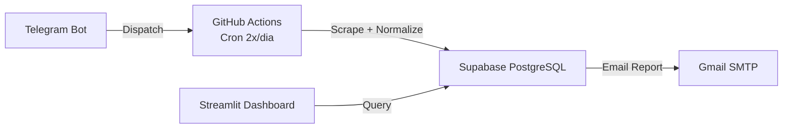

# CustoDoce - Memória do Projeto

## Sobre
Projeto de busca e comparação de preços de ingredientes para confeitaria.
Foco na Baixada Santista (Santos, São Vicente, Praia Grande, Mongaguá, Itanhaém, Peruíbe)
e São Paulo Capital. Infraestrutura 100% gratuita.

## Stack
- **DB/API**: Supabase (PostgreSQL) - 500MB free
- **Scrapers**: GitHub Actions (Python, 2.000 min/mês)
- **Dashboard**: Streamlit Cloud (Python, 1 app privado grátis)
- **Bot**: Telegram (python-telegram-bot)
- **Email**: Gmail SMTP (500 e-mails/dia)
- **Total Free Tier**: R$ 0,00

## Arquitetura



## Estrutura de Diretórios

```
CustoDoce/
├── .github/workflows/
│   ├── scrape.yml                   # Coleta automática (cron + deploy)
│   └── ci.yml                       # CI: ruff + bandit + pytest + pip-audit
├── config/
│   ├── ingredients.yaml             # 11 ingredientes canônicos + aliases + search_terms
│   ├── stores.yaml                  # 49 lojas (Tier 1-4)
│   ├── features.yaml                # Flags declarativas liga/desliga
│   └── schema_prices.json           # Contrato de dados
├── scrapers/
│   ├── base_flyer.py                # ABC: download PDF + ETag cache + OCR fallback
│   ├── base_web_scraper.py          # ABC: httpx.Client + context manager + rate limit
│   ├── flyer_scraper.py             # Scraper genérico para PDFs (substitui 8 subclasses)
│   ├── flyer_parser.py              # Parser genérico de linhas de PDF
│   ├── vtex_scraper.py              # Scraper VTEX API (herda BaseWebScraper)
│   ├── website_scraper.py           # Scraper HTML (herda BaseWebScraper)
│   ├── carrefour_scraper.py         # Scraper Carrefour (herda BaseWebScraper)
│   ├── tenda_api_scraper.py         # API Tenda (herda BaseWebScraper)
│   ├── roldao_api_scraper.py        # API Roldão (herda BaseWebScraper)
│   ├── max_api_scraper.py           # API Max (herda BaseWebScraper)
│   ├── aggregator_scraper.py        # Agregadores SSR (Tiendeo, Guiato)
│   ├── playwright_scraper.py        # Agregadores JS (Playwright)
│   ├── ocr.py                       # OCR fallback (Tesseract)
│   └── unit_extractor.py            # Extrator centralizado de unidade
├── parsers/
│   ├── normalizer.py                # Extrai unidade → R$/kg + R$/un
│   └── matcher.py                   # token_set_ratio ≥80% (RapidFuzz)
├── services/
│   ├── supabase_client.py           # Singleton conexão
│   ├── price_service.py             # CRUD + busca + cleanup_old_prices/logs
│   ├── flyer_service.py             # CRUD flyers + cleanup_old_flyers
│   ├── email_service.py             # SMTP genérico (SMTP_* ou GMAIL_* fallback)
│   ├── telegram_service.py          # Telegram Bot API
│   ├── config.py                    # Config loader (cache + reload)
│   ├── config_db.py                 # DB-backed config (ingredients, stores, schedules, etc.)
│   ├── auth.py                      # PBKDF2 + JWT + TOTP
│   └── rate_limiter.py              # SQLite rate limit
├── telegram_bot/
│   └── handlers.py                  # /preco, /lista, /status
├── admin/
│   └── app.py                       # Streamlit dashboard (17 abas)
├── dashboard/
│   ├── login_page.py                # Auth + 2FA
│   └── components/
│       ├── ui.py                    # CSS + componentes reutilizáveis
│       └── layout.py                # Sidebar com navegação (17 páginas)
├── supabase/
│   ├── seed.sql                     # Tabelas + índices + RLS + triggers
│   └── consolidated_migration.sql   # Migração consolidada (574 linhas)
├── scripts/
│   ├── seed_prices.py               # Gera dados sintéticos (--dry-run/--execute/--json)
│   ├── deploy_database.py           # Migração SQL (--dry-run/--execute/--output)
│   ├── send_daily_report.py         # Relatório diário por email
│   └── deploy_check.py              # Health check pré-deploy
├── tests/
│   ├── test_dashboard_full.py       # 78 testes unitários
│   ├── test_services_mocked.py      # 49 testes com mocks
│   └── README.md                    # Plano de testes
├── main.py                          # Orquestrador: collect + cleanup loop
├── requirements.txt                 # Dependências runtime
├── requirements-dev.txt             # Ferramentas de qualidade
├── packages.txt                     # System deps (tesseract-ocr, poppler-utils)
└── data/
    └── prices_latest.json           # Snapshot da última coleta
```

## Tiers de Lojas

| Tier | Tipo | Frequência | Como coleta |
|------|------|------------|-------------|
| 1 | PDF Direto (9 redes atacadistas) | Semanal (quarta/quinta) | Automatizado - pdfplumber |
| 2a | E-commerce SP (VTEX API) | Diária | Automatizado - requests API |
| 2b | Atacado Físico SP (Manos, Jabaquara etc.) | Mensal | Manual - visita + planilha |
| 3 | Agregadores (Tiendeo, Guiato) | Fallback | Automatizado - if tier 1/2 fail |
| 4 | Manual (WhatsApp, visita local) | Sob demanda | Planilha .xlsx |

## Ingredientes Monitorados (11)
1. Leite Condensado Integral (lacteos)
2. Creme de Leite 20% Gordura (lacteos)
3. Chocolate em Pó 50% Cacau (chocolates)
4. Leite Ninho Integral (lacteos)
5. Granulado Melken Ao Leite (confeitos)
6. Granulado Melken Branco (confeitos)
7. Granulado Melken Meio Amargo (confeitos)
8. Nutella (pastas)
9. Coloretti Granulado Colorido (confeitos)
10. Coco Ralado Grosso sem Açúcar (secos)
11. Chocolate Nobre Blend Harald (chocolates)

## Fluxo de Coleta (GitHub Actions)

```
1. Checkout repo
2. sudo apt-get tesseract-ocr (OCR fallback)
3. pip install -r requirements.txt
4. Cache MD5 de PDFs
5. main.py:
   a. Para cada loja Tier 1:
      - Se quarta/quinta:
        - build_url(week)
        - HEAD request (check ETag)
        - Se mudou: download PDF
        - MD5 check (cache)
        - Se igual → skip
        - pdfplumber extract text
        - Se vazio → OCR fallback (Tesseract)
        - flyer_parser → linhas produto + preço + unidade
        - process_price_match():
          - Matcher ≥80% → upsert_price()
          - Matcher 30-80% → insert_review_item(sugestões)
   b. Para cada loja Tier 2a (VTEX):
      - GET api/catalog_system/pub/products/search?ft=
      - Parse JSON VTEX → raw products
      - process_price_match() (mesmo fluxo acima)
   c. Para cada loja Tier 3 (Website):
      - GET {base_url}/busca?q=
      - selectolax → CSS selectors → raw products
      - process_price_match() (mesmo fluxo acima)
6. git commit data/prices_latest.json
7. Se 1º do mês: Release GitHub com snapshot mensal (prices_latest.json.gz)
8. Sempre: send_daily_report.py (email com top 5 preços por ingrediente)
```

## Matcher (parsers/matcher.py)

1. **Exact match**: canonical name in product text (case-insensitive)
2. **Alias exact**: each alias checked via `in` operator
3. **Word subset**: all canonical words found in product text
4. **Fuzzy fallback**: RapidFuzz `fuzz.token_set_ratio(product, canonical/alias)` threshold 80%
5. **Confidence Score**: 1.0 (exact), 0.8-1.0 (fuzzy ≥80%), <0.8 (review queue)
6. **Review Queue**: items with confidence <80% go to `review_queue` table

## Normalizer (parsers/normalizer.py)

```python
# Extrai do texto bruto: qty, unit_kg, total_kg
"cx 12x395g"       → qty=12, unit_kg=0.395, total_kg=4.74
"2kg"              → qty=1,  unit_kg=2.0,   total_kg=2.0
"500g"             → qty=1,  unit_kg=0.5,   total_kg=0.5
"cx 24x200g"       → qty=24, unit_kg=0.2,   total_kg=4.8
"12un 395g"        → qty=12, unit_kg=0.395, total_kg=4.74
"lata 1kg"         → qty=1,  unit_kg=1.0,   total_kg=1.0

# Preço normalizado:
price_per_kg = raw_price / total_kg
price_per_un = raw_price / qty
```

## Tratamento de Checagem e Validação de PDF

```python
# Em: scrapers/base_flyer.py
# Sequência:
# 1. generate URL from template: url_pattern.format(week=week, city=city)
# 2. httpx HEAD request (check ETag / Content-Length)
# 3. If modified: GET full PDF
# 4. compute MD5(content)
# 5. compare with cached MD5 (data/cache/{store}_md5.txt)
# 6. if same → skip (no changes)
# 7. if different → pdfplumber → extract text
# 8. update cache file
```

## Tratamento de Erros

| Erro | Ação |
|------|------|
| PDF não encontrado (404) | Loga aviso, pula loja |
| Timeout no download | Retry 2x, depois pula |
| ETag não mudou | Pula (cache hit) |
| pdfplumber vazio | Pula (PDF rasterizado - OCR fallback) |
| Matcher <80% | Vai para review_queue |
| Supabase offline | Salva em prices_latest.json local como fallback |
| Email falha | Loga erro, não bloqueia pipeline |

## Comandos Relevantes

```bash
# Testar um scraper manualmente
python -c "from scrapers.base_flyer import BaseFlyerScraper; s = BaseFlyerScraper({'name':'Assaí','url_pattern':'...'}); print(s.run())"

# Testar normalizer
python -c "from parsers.normalizer import normalize_price; print(normalize_price(42.90, 'cx 12x395g'))"

# Testar matcher
python -c "from parsers.matcher import match_ingredient; ing = [{'canonical':'Leite Condensado','aliases':[]}]; print(match_ingredient('Leite Condensado Moça 12un', ing))"

# Validar schema
python -c "import json, jsonschema; s=json.load(open('config/schema_prices.json')); jsonschema.validate({'ingredient_id':'x','store_id':'y','raw_price':1.0,'raw_product':'test','raw_unit':'un','collected_at':'2025-01-01','source':'manual'}, s)"
```

## Regras de Execução

1. **SEMPRE apresentar um plano antes de executar.** Conter: diagnóstico, correção proposta, e verificação. O usuário decide se quer que eu execute ou que outro agente execute.

2. **NUNCA fazer commit sem autorização explícita do usuário.** Mesmo que a correção esteja pronta e testada, esperar ordem.

3. **Ao pedir deploy, sempre pedir autorização.** Nunca deployar por conta própria.

4. **Após completar uma tarefa, apresentar resumo e esperar instrução.** Não assumir que devo seguir para a próxima coisa automaticamente.

## Regras de Responsividade

- **TODO componente deve ser responsivo**: celular (320px+), tablet (768px+), desktop (1024px+)
- **KPIs**: flex grid 2x2 no mobile, 4x1 no desktop
- **Tabelas**: `overflow-x: auto` + `min-width: 600px` — **nunca esconder colunas**
- **Grids**: CSS `grid-template-columns` com `repeat(auto-fill, minmax(...))` + media queries
- **Sempre validar** visualmente em múltiplos viewports antes de dar como pronto

## Infraestrutura de Testes

### Ferramentas
- `ruff` — lint (zero erros)
- `mypy` — type hints (pendente)
- `bandit` — segurança (zero issues)
- `pip-audit` — CVEs (zero vulnerabilidades)
- `radon` — complexidade (média B)
- `pytest` — 127 testes (F1-2: 22, F3: 20, F4-6: 20, F7: 8, F8: 6, F9: 6, Cleanup: 8, Security: 2, Imports: 2)

### Checklist por Fase
```
ruff check . && bandit -r admin/ dashboard/ services/ -x tests/ && pip-audit && python -m pytest tests/ -v
```

### Arquivos
- `tests/README.md` — plano de testes completo
- `requirements-dev.txt` — ferramentas de qualidade
- `tests/test_dashboard_full.py` — 78 testes unitários
- `tests/test_services_mocked.py` — 49 testes com mocks

## Fase 4 — CRUD Console (concluida)

| O que foi feito | Resultado |
|----------------|-----------|
| `tab_visao_geral` refatorada | E(38) → A(2) + 6 sub-funcoes |
| `tab_lojas` com filtros, busca, editor YAML | ✅ |
| `tab_ingredientes` com abas + testadores | ✅ |
| `_test_normalizer()` + `_test_matcher()` | ✅ |
| `generate_secret_key()` em auth.py | ✅ |
| Bug `is_limited` corrigido no rate_limiter | ✅ |
| 49 testes, ruff, bandit, pip-audit | ✅ Todos limpos |

## Fase 5 — Control & Reports (concluida)

| O que foi feito | Resultado |
|----------------|-----------|
| `tab_relatorios` — builder HTML com preview + envio | ✅ |
| `tab_relatorios` — abas: Relatorio, Testar SMTP, Testar Telegram | ✅ |
| `_test_smtp()` — testa conexao Gmail SMTP | ✅ |
| `_test_telegram()` — testa envio via Telegram Bot API | ✅ |
| `_render_schedule_info()` — exibe crons do scrape.yml | ✅ |
| `tab_scrapers` melhorada com schedule + logs | ✅ |
| 55 testes, ruff, bandit, pip-audit | ✅ Todos limpos |

## Fase 6 — System Config & Diagnostics (concluida)

| O que foi feito | Resultado |
|----------------|-----------|
| `tab_config` — secrets editor inline com edicao + salvar `.env` | ✅ |
| `tab_config` — variaveis agrupadas por categoria (5 grupos, 13 vars) | ✅ |
| `_mask_val()` — mascaramento padrao de secrets | ✅ |
| `tab_diagnostico` — testes individuais por componente com timing | ✅ |
| `tab_diagnostico` — testadores SMTP e Telegram inline | ✅ |
| `_render_schedule_info` — modo edicao de cron expressions | ✅ |
| Botao "Executar Todos" + "Limpar Resultados" | ✅ |
| 62 testes, ruff, bandit, pip-audit | ✅ Todos limpos |

## Fase 7 — Polish, Config Declarativo & Deploy (concluida)

| O que foi feito | Resultado |
|----------------|-----------|
| `config/features.yaml` — flags declarativas liga/desliga | ✅ |
| `services/config.py` com `get()` + cache + `reload()` | ✅ |
| Config guards no dashboard (telegram/email/alerts/export) | ✅ |
| `:focus-visible` rings CSS + `aria-label` sidebar | ✅ |
| Export CSV com `st.download_button` em Precos/Historico | ✅ |
| `scripts/deploy_check.py` — testa Supabase/Gmail/Telegram | ✅ |
| 70 testes, ruff, bandit, pip-audit | ✅ Todos limpos |

## Fase 8 — Dedup, Cleanup & Segurança (concluida)

| O que foi feito | Resultado |
|----------------|-----------|
| `upsert_price()` com `collected_at` truncado pra data (UNIQUE por dia) | ✅ |
| `insert_review_item()` dedup por `(store_name, raw_product)` — qualquer status | ✅ |
| `cleanup_old_prices(90)` — deleta prices + price_history > 90 dias | ✅ |
| `cleanup_old_logs(30)` — deleta scraping_logs > 30 dias | ✅ |
| `cleanup_old_flyers(60)` — deleta flyers com OCR failed + >60 dias | ✅ |
| Loop de cleanup no `main.py` (3 funções sequenciais) | ✅ |
| XSS sanitization `_sanitize()` — html.escape em todo unsafe_allow_html | ✅ |
| Senha hardcoded removida — `os.environ.get("ADMIN_PASSWORD")` + fallback | ✅ |
| HTML injection fix em `email_service.py` — _html.escape() | ✅ |
| `consolidated_migration.sql` — 574 linhas, todas as tabelas + funções | ✅ |
| 127 testes, ruff, bandit, pip-audit | ✅ Todos limpos |

## Fase 9 — Dashboard Insights (concluida)

| O que foi feito | Resultado |
|----------------|-----------|
| `tab_fontes` — Cobertura por Ingrediente + Promoções Ativas + Ranking Fontes | ✅ |
| `tab_ranking` — Gráfico linha/área/barras + ranking atual + estatísticas | ✅ |
| `tab_insights` — Heatmap (px.imshow) + Outliers (desvio padrão) + Melhores Ofertas | ✅ |
| `packages.txt` — tesseract-ocr + poppler-utils para Streamlit Cloud | ✅ |
| `ci.yml` — ruff + bandit + pytest + pip-audit em cada push/PR | ✅ |
| `seed_prices.py` — gera 4128 preços sintéticos (11 ing × 20 lojas × 91 dias) | ✅ |
| 17 páginas no dashboard sidebar | ✅ |
| 127 testes, ruff, bandit, pip-audit | ✅ Todos limpos |

## Status das Fases

- **Fase 1** ✅ Estrutura base (pastas, parsers, services, schema, base_flyer)
- **Fase 2** ✅ Scrapers VTEX — `vtex_scraper.py` (Rizzo, Amendolate, Loja Sto Antônio + demais VTEX)
- **Fase 3a** ✅ Scrapers site — `website_scraper.py` (Cacau Center, Confeitos & Cia, Padeirão + demais)
- **Fase 3b** ✅ Template planilha visitas SP (`scripts/generate_visit_template.py`) + importador (`scripts/import_visit_spreadsheet.py`)
- **Fase 3c** ✅ Dashboard Flyers & History — grid responsivo de flyers, detale com OCR, gráficos históricos com R$/kg, heatmap de cobertura, KPIs na Home
- **Fase 4** ✅ Fila de revisão no dashboard — `process_price_match()` roteia <80% para `review_queue`; dashboard permite aprovar/rejeitar com seleção de ingrediente
- **Fase 5** ✅ Control & Reports — `tab_relatorios` (builder HTML + preview + envio); `_test_smtp()` / `_test_telegram()`; agendamento exibido em `tab_scrapers`
- **Fase 6** ✅ System Config & Diagnostics — secrets editor `tab_config` (5 grupos, 13 vars, inline edit + save `.env`); `tab_diagnostico` com testes individuais + SMTP/Telegram inline; schedule manager com edição de crons
- **Fase 7** ✅ Polish & Deploy — `config/features.yaml` (flags declarativas liga/desliga); `services/config.py` com `get()` + cache + `reload()`; config guards no dashboard; `:focus-visible` rings CSS + `aria-label` sidebar; export CSV com `st.download_button`; `scripts/deploy_check.py`
- **Fase 8** ✅ Dedup & Cleanup — `collected_at` truncado pra data; review queue dedup sem filtro status; `cleanup_old_prices(90)` + `cleanup_old_logs(30)` + `cleanup_old_flyers(60)`; XSS sanitization; HTML injection fix; consolidated migration SQL
- **Fase 9** ✅ Dashboard Insights — `tab_fontes` (cobertura + promoções + ranking); `tab_ranking` (gráficos + estatísticas); `tab_insights` (heatmap + outliers + melhores ofertas); CI/CD (ci.yml + packages.txt); seed data (4128 preços sintéticos)
