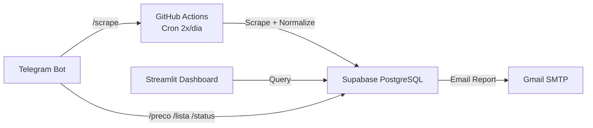

# CustoDoce - Memória do Projeto

> **~340 linhas vivo.** Lições → `LESSONS.md`. Regras infra → `REGRAS.md`.

## Regras Mandatórias (Top 10)

1. **Schema contracts**: `config/agents_schema.yaml` define o que entra aqui. CI valida.
2. **Mocks derivam do schema manifest**: `config/schema_manifest.json` (gerado offline do SQL) é a fonte única. Mocks em `tests/unit/fixtures/mock_data.py` devem passar 97 checks (nomes, types, not_null, defaults, FKs, enums, jsonb). CI valida em todo PR no job `lint`.
3. **Padrão de Testes**: Novo código = novos testes (`test_<modulo>.py`); testes com Supabase real devem usar `@pytest.mark.integration`.
4. **`exec_sql_query` RPC (porta 443), NUNCA `psycopg2`**: GH Actions bloqueia 5432.
5. **<55% vai pra review_queue**: `match_type`, `match_reason`, brand, top3 candidatos.
6. **Self-healing em todo scraper**: `record_failure/success()` obrigatório. `scraper_health.py`.
7. **`normalized` pode ser `true` (bool)** — SEMPRE proteger: `isinstance(raw, dict)` antes de `.get()`.
8. **Migration SQL nova → adicionar em `scripts/deploy_database.py::generate_consolidated()`**.
9. **`httpx` pinado `<1.0`** no `requirements.txt`.
10. **Paridade Total de Ambiente (expandida)**: Python, deps (requirements.lock), runtime, OS, versões de ferramentas e **todos os componentes** devem ser IDÊNTICOS entre local (Windows/WSL), CI (GitHub Actions) e Cloud (Streamlit). Isso inclui obrigatoriamente:
    - **Python**: `.venv314`/`custodoce-314` (3.14.6) = CI (3.14.6) = `runtime.txt` (3.14.6) = devcontainer (3.14).
    - **Lock files**: `requirements-*.lock` são a **única fonte de verdade** (`requirements.txt`, `requirements.lock` são cópias). `check_environment_parity.py` valida sincronia entre todos.
    - **Lock file generation**: `pip-compile` DEVE rodar **SEMPRE em WSL/Linux** (`custodoce-314` ou CI Ubuntu) — NUNCA no Windows. Windows resolve `colorama`/`tzdata` (condicionais de plataforma) que não existem no Linux → drift silencioso. (Ver `LESSONS.md` #52, `REGRAS.md` regra 5.)
    - **pip install em workflows**: PROIBIDO sem pin de versão explícito (`package==X.Y.Z`). Todo `pip install` fora do lock file DEVE ter `==` para evitar drift silencioso.
    - **Actions @tags**: Devem ser consistentes em TODOS os workflows: `checkout@v7`, `setup-python@v6`, `cache@v6`, `upload-artifact@v7`. Qualquer outlier bloqueia merge.
    - **System deps (tesseract/poppler/playwright)**: Instalados com mesmo comando em CI, devcontainer e WSL. `packages.txt` é a lista canônica; toda alteração deve ser refletida em AMBOS os locais.
    - **Devcontainer**: Deve espelhar o Python target do projeto e usar lock files (não `requirements.txt`).
    - **Verificação automática**: `python scripts/check_environment_parity.py` roda no CI (job `lint`) e falha HARD em qualquer divergência. Localmente, o pre-push hook também valida (incluindo detecção de pacotes Windows-only nos lock files).
    - **Qualquer divergência bloqueia merge** — CI valida no alvo real. (Ver `REGRAS.md` §4)
11. **Falha no CI = Gap de Teste (ciclo RPR)**: Toda falha no CI não detectada localmente exige ciclo **RPR mínimo** antes de re-disparear: (1) **Reproduzir** local com teste que falha, (2) **Prevenir** com teste de regressão (permanente), (3) **Registrar** em `LESSONS.md` (sintoma + causa + correção + teste). Re-rodar o CI "pra ver se passa" é proibido — gasta minutos de runner e mascara bugs. `continue-on-error: true` para mascarar falha sem corrigir causa também é proibido. **Exceções** (sem RPR completo): (a) timeout/flakiness de rede/scraper, (b) outage de infra externa (GitHub/Supabase), (c) mudanças apenas em `workflows/*.yml` (RPR simplificado: só registro, sem teste novo).
12. **Monitoração Total do CI**: O acompanhamento do push deve ir até o status FINAL (success/failure). Em shells com timeout, o uso de polling (consultas repetidas ao `gh run view`) é a estratégia mandatória para evitar interrupções prematuras.
13. **Sessões isoladas em branches dedicadas**: Cada sessão de trabalho (feature/fix/chore) roda em sua própria branch a partir de `master` limpo. Nunca misturar state de múltiplas sessões no mesmo working tree. Antes de começar: `git checkout master && git pull && git checkout -b feature/<escopo>`. Working tree sujo = stashear para branch `wip/<contexto>` ou commitar antes. CI verde em master é contrato. Para PR: rebase + squash merge. Detalhes em `REGRAS.md` §Branches.
14. **Line endings — Windows `autocrlf=true`, WSL `false/input`**: `core.autocrlf=true` no Windows é OBRIGATÓRIO (Git converte CRLF→LF no staging silenciosamente). No WSL/Linux, `false` ou `input`. `.gitattributes` com `eol=lf` por tipo de arquivo é a fonte da verdade. O script `scripts/check_line_endings_config.py` valida a configuração correta por plataforma e roda no pre-push. CRLF auto-fix em hooks é PROIBIDO — a correção raiz é configurar o Git, não tratar sintoma. (Ver `LESSONS.md` #49)
15. **`git_push.py` exige `gh`/`git` no PATH (correção de RAIZ)**: O `git push` dispara o pre-push hook que chama `gh` — se o PATH do processo Python (herdado do cmd.exe/PowerShell) não trouxer `C:\Program Files\GitHub CLI` e `C:\Program Files\Git\bin`, o hook falha com `FileNotFoundError` (push aborta FALSAMENTE). O `scripts/git_push.py` injeta esses caminhos via `_ensure_bin_path()` antes de qualquer subprocesso. Se `gh` der `FileNotFound`, é problema de AMBIENTE — corrigir o PATH, **NUNCA** usar `--no-verify` ou `git push` direto para contornar. (Ver `LESSONS.md` #80)

## Sobre

Busca e comparação de preços de ingredientes para confeitaria. Foco na Baixada Santista e São Paulo Capital. Infraestrutura 100% gratuita.

## Stack

- DB/API: Supabase (PostgreSQL, 500MB free)
- Scrapers: GitHub Actions (Python, 2.000 min/mês)
- Dashboard: Streamlit Cloud (1 app privado)
- Bot: Telegram (python-telegram-bot)
- Email: Gmail SMTP (500 e-mails/dia)
- AI/ML: Sentence-Transformers (ONNX), Groq API, Scikit-learn (Isolation Forest)
- **Free Tier Total**: R$ 0,00

## Arquitetura



## Estrutura de Diretórios

```
CustoDoce/
├── .github/workflows/
│   ├── scrape.yml, ci.yml, e2e.yml, backup.yml, restore-test.yml
│   ├── on_demand_scrape.yml, ci-e2e-only.yml
│   ├── heal-scrapers.yml                             # Cron 15d auto-heal
│   ├── skills-maintenance.yml                       # Cron mensal (dia 1, 9am UTC)
│   └── dependency-audit.yml                         # Cron mensal (dia 1, 9am UTC) — pip-audit + deptry + licenses
├── .githooks/
│   ├── pre-commit                                     # 12 camadas (SECRET GUARD, GITIGNORE IMPORTS, DETECT-SECRETS, RUFF LINT, DOC SYNC, SIZE GUARD, DOC WATCHDOG, AGENTS SCHEMA, MD AUTO-COMPRESS, SKILL DRIFT, RESIDUE GUARD, CRLF GUARD)
│   └── pre-push                                       # Python, 9 checks paralelos (block + auto-fix sync_docs)
├── config/
│   ├── ingredients.yaml, stores.yaml, features.yaml
│   ├── schema_manifest.json                          # Schema offline (gerado por scripts/generate_schema_manifest.py)
│   ├── schema_prices.json, agents_schema.yaml, scoring_config.yaml
├── scrapers/          # base_flyer, vtex, playwright, flyer, parser, ocr, etc.
├── parsers/           # normalizer, matcher, brand_extractor, llm_cache, llm_strategies, llm_classifier
├── services/          # supabase_client, price_*, collector, email, telegram, alert, logger, otel, etc.
├── dashboard/         # login_page, components/ (ui, layout), pages/ (18 módulos)
├── telegram_bot/      # handlers.py
├── admin/app.py       # 107 linhas — importa 19 pages
├── supabase/          # seed.sql, consolidated_migration.sql, migrations 002-006
├── scripts/           # deploy, validate, sync, audit, seed, heal, sanity, send_report, skills_maintenance, md_auto_compress
├── tests/             # unit (729), schema (94), calibration (1), integration, design, e2e, real
│   ├── unit/fixtures/                                # Mock data central (16 tabelas em mock_data.py)
│   ├── unit/test_services/                           # 13 módulos decompostos (119 tests)
│   │   ├── conftest.py                               # Mock helpers compartilhados
│   │   ├── test_price.py, test_config.py, ...
│   ├── calibration/                                  # Scoring calibration contra dados reais
│   │   ├── __init__.py
│   │   └── test_scoring_calibration.py               # 1 test (regressão scoring weights)
│   └── diagnostics/                                  # Testes lentos (pip-audit, ruff, mypy, secrets)
├── data/prices_latest.json
├── pyproject.toml     # Ruff 120 chars, mypy 3.12, pytest config
├── requirements-prod.in   # Deps de produção (pip-compile source)
├── requirements-dev.in    # Deps de dev: ruff, mypy, bandit, detect-secrets
├── requirements-test.in   # Deps de teste: pytest, playwright, faker
├── requirements-prod.lock  # Pinned (só prod)
├── requirements-dev.lock   # Pinned (prod + dev)
├── requirements-test.lock  # Pinned (prod + dev + test)
├── requirements.lock       # = requirements-test.lock (backward compat)
├── requirements.txt        # = requirements-prod.in (pip-audit source)
├── AGENTS.md          # ← este arquivo (vivo, ~340 linhas)
├── LESSONS.md         # 72 lições aprendidas
└── REGRAS.md          # Ambiente, hooks, comandos
```

## Tiers de Lojas

| Tier | Tipo | Frequência | Como coleta |
|------|------|------------|-------------|
| 1 | PDF Direto (9 redes atacadistas) | Semanal (qua/qui) | pdfplumber + OCR fallback |
| 2a | E-commerce SP (VTEX API) | Diária | requests API |
| 2b | Atacado Físico SP | Mensal | Manual (planilha) |
| 3 | Agregadores (Tiendeo, Guiato) | Fallback | Playwright / SSR |
| 4 | Manual (WhatsApp, visita) | Sob demanda | Planilha .xlsx |

## Ingredientes Monitorados (23)

[Leite Condensado, Creme de Leite, Chocolate 50%, Leite em Pó, Granulado Ao Leite, Granulado Branco, Granulado Meio Amargo, Creme de Avelã, Granulado Colorido, Coco Ralado, Chocolate Nobre Blend, Açúcar Mascavo, Açúcar Confeiteiro, Chocolate 70%, Farinha de Trigo, Micro Ball, Top Confete, Gotas Branco, Manteiga, Gotas Meio Amargo, Chocolate Barra, Fermento, Baunilha] — detalhes completos em `config/ingredients.yaml`.

## Fluxo de Coleta (GitHub Actions scrape.yml)

```
main.py → sync_store_fields() → para cada loja ativa:
  Tier 1 (PDF): build_url → HEAD (ETag) → download → MD5 cache → pdfplumber → OCR fallback
  Tier 2a (VTEX): GET api/products/search?ft= → parse JSON
  Tier 3 (site): GET /busca?q= → selectolax CSS selectors
  Todos → process_price_match():
    → match_ingredient() [exact → alias → word_subset → fuzzy RapidFuzz ≥80%]
    → se ≥80%: upsert_price_rpc()
    → se 55-79%: semantic_matcher blend (RapidFuzz 0.6 + embeddings 0.4)
    → se 65-80%: llm_classifier (Groq)
    → se <55%: review_queue
  Fim: enrich_prices() [Isolation Forest] → commit prices_latest.json → email report
  1º do mês: release GitHub com snapshot .json.gz
```

## Matcher (parsers/matcher.py)

1. **Exato**: canonical name no texto do produto
2. **Apelido exato**: cada alias com `in` operator
3. **Contido**: todas as palavras do canonical no produto
4. **Fuzzy**: RapidFuzz `fuzz.token_set_ratio(product, canonical/alias)` ≥80%
5. **Match types**: `exato` / `proximo_nome` / `proximo_apelido` / `contido`
6. **Confidence**: 1.0 (exato), 0.8-1.0 (fuzzy), <0.8 (review queue)
7. **Brand extraction**: 3 níveis (exato → substring regex → fuzzy palavra a palavra ≥80%)

## Normalizer (parsers/normalizer.py)

```
"cx 12x395g" → qty=12, unit_kg=0.395, total_kg=4.74
"2kg"        → qty=1,  unit_kg=2.0,   total_kg=2.0
"500g"       → qty=1,  unit_kg=0.5,   total_kg=0.5
"12un 395g"  → qty=12, unit_kg=0.395, total_kg=4.74
"lata 1kg"   → qty=1,  unit_kg=1.0,   total_kg=1.0

price_per_kg = raw_price / total_kg
price_per_un = raw_price / qty
```

## Tratamento de Erros

| Erro | Ação |
|------|------|
| PDF 404 | Loga aviso, pula loja |
| Timeout | Retry 2x, depois pula |
| ETag não mudou | Pula (cache hit) |
| pdfplumber vazio | OCR fallback (Tesseract) |
| Matcher <80% | Review queue |
| Supabase offline | Salva em prices_latest.json local |
| Email falha | Loga erro, não bloqueia pipeline |
| Porta 5432 bloqueada | `exec_sql_query` RPC (porta 443) |

## CI Watch (push + monitoramento automático)

Para evitar "push → CI falha → ninguém vê", substitua `git push` por `python scripts/git_push.py [args]` (ou `git config --local alias.pw '!python scripts/git_push.py' && git pw`). O script roda o push, detecta o run do CI e faz polling de `gh run view --json conclusion` até a conclusão final (timeouts de shell proíbem `gh run watch`). Em falha: ruff→auto-fix+re-watch (1x); timeout/flaky→re-run (1x); erro diferente/bandit/pip-audit/pytest→**PARA** (humano assume). Auto-fix usa `--force-with-lease`. Detalhes em `REGRAS.md` e `scripts/git_push.py`.

## Teste Full Manual (disparo manual único)

Workflow `Teste_Full_Manual` (Actions → Run workflow) — testa TUDO de uma vez: lint, typecheck, docs-sync, unit+schema, integration, deploy-check, real, e2e-full, visual e diagnostics (~55min). Listas de páginas vêm de `navigation_config.MENU_GROUPS` (auto-adapta a `dashboard/pages/`).

## ⚠️ Regra Obrigatória: DB Sync

**Toda alteração em SQL/funções/triggers deve ser verificada na base real do Supabase via RPC (`exec_sql_query`, porta 443).** NUNCA `psycopg2` direto.

```bash
python scripts/deploy_database.py --execute
ruff check . && python -m pytest tests/unit/ tests/schema/ -q
```

## Comandos Relevantes

```bash
# Lint + type + test
ruff check . && python -m mypy . && python -m pytest tests/unit/ tests/schema/ -q

# Gestão do AGENTS.md
python scripts/agents_tool.py --check      # Valida schema
python scripts/agents_tool.py --full       # Validação completa
python scripts/agents_tool.py --status     # Estado atual
python scripts/agents_tool.py --add-rule   # Adicionar regra top 10
python scripts/agents_tool.py --add-lesson # Adicionar lição

# Push + CI Watch (recomendado, substitui git push)
python scripts/git_push.py [args]          # git push + assiste CI até o fim
git config --local alias.pw '!python scripts/git_push.py' && git pw [args]

# Schema / DB
python scripts/deploy_database.py --dry-run
python scripts/validate_db_schema.py

# Testes específicos
python -m pytest tests/unit/ tests/schema/ -q

# Schema / DB
python scripts/generate_schema_manifest.py
python -m pytest tests/unit/test_validate_mocks_against_manifest.py -q

# Testes lentos (diagnóstico)
python -m pytest tests/diagnostics/ -q -m slow

# MD Auto-Compress
python scripts/md_auto_compress.py compress --dry-run
python scripts/md_auto_compress.py compress --apply
python scripts/md_auto_compress.py rollback <target> --archive-dir docs/archive/<src>
```

## Status Atual

| Métrica | Valor |
|---------|-------|
| pytest (unit + schema, no slow) | 1039 passing |
| pytest (integration) | 112 passing |
| pytest (diagnostics, slow) | 4 passing |
| Schema manifest | 17 tabelas/views com types, not_null, defaults, constraints |
| Mock validation tests | 97 parametrizados (colunas, tipos, not_null, FKs, CHECK, jsonb) |
| AGENTS.md | ~340 linhas (Sprint 14 — md_auto_compress) |
| LESSONS.md | 72 lições |
| REGRAS.md | Ambiente + hooks + comandos |
| CI lint/type/test | ✅ Todos verdes (Python 3.14.6) |
| E2E (cloud) | ⏳ Mensal (Playwright) |
| Python local (Windows) | 3.14.6 (`.venv314`) |
| Python CI (GitHub Actions) | 3.14.6 (`PYTHON_VERSION=3.14.6`) |
| Python WSL | 3.14.6 (`custodoce-314`) |
| Python Cloud (Streamlit) | 3.14.6 |
| requirements-prod.lock | ~100 packages (só prod) |
| requirements-dev.lock | ~115 packages (prod + lint) |
| requirements-test.lock | 130+ packages (prod + dev + test) |
| OpenCode Skills | 33 installed (todas no projeto) |
| Dashboard pages | 19 módulos (inclui CI Telemetria) |
| Workflows GitHub Actions | 8 otimizados, validados, com check_time_budget |

## OpenCode Skills

Lista canônica em [docs/skills.md](docs/skills.md) — gerado por `python scripts/sync_docs.py --sync`.

| Métrica | Valor |
|---|---|
| Skills instaladas | 33 (ver docs/skills.md) |
| Sub-themes (theme-factory) | 10 (arctic-frost, ... tech-innovation) |
| Externas (não adotadas) | frontend-design, theme-factory |

### Manutenção

```bash
python scripts/skills_maintenance.py --check      # Status freshness
python scripts/skills_maintenance.py --validate    # Estrutura/frontmatter
python scripts/skills_maintenance.py --full        # Backup + check + validate
python scripts/skills_maintenance.py --list        # Listar instaladas
python scripts/sync_docs.py --sync                # Regenera docs/skills.md
```

### Cron

- **Mensal** (1º do mês, 6am SP / 9am UTC): `skills-maintenance.yml` executa `--check --validate`
- **Mensal** (1º do mês, 9am UTC): `dependency-audit.yml` executa `pip-audit` + `deptry` + `pip-licenses`
- **A cada PR**: CI valida estrutura das skills modificadas
- **A cada PR (requirements*.txt / *.in / *.lock)**: `dependency-audit.yml` job `audit-prod` bloqueia se `pip-audit --strict -r requirements.txt` falhar; `lock-validation` verifica sincronia entre `.in` e `.lock`
- **Detecção de drift**: `sync_docs --check` no `ci.yml` job `docs-sync` — falha se disco ≠ approved ≠ docs

## Ambiente

**Python local OBRIGATÓRIO: `.venv314`** (PowerShell → `& .\.venv314\Scripts\Activate.ps1`).

O **`pre-push`** detecta `.venv314` automaticamente via `_resolve_python()` (ver `REGRAS.md` §Pre-push). Independente de como o git foi invocado, todo subprocesso do hook usa o Python do venv → **paridade total com CI/Cloud**. Fallback `sys.executable` é apenas aviso, não erro.

Para WSL: `custodoce-314` (Conda, Python 3.14). Detalhes em `REGRAS.md`.

## Documentação Relacionada

- `LESSONS.md` — 72 lições (CI, mocks, schema, scrapers, monitoração, segurança)
- `REGRAS.md` — Ambiente, hooks, comandos, arquitetura
- `docs/skills.md` — Skills OpenCode (globais + overlays locais)
- `docs/changelog.md` — Histórico por fase/sprint; `config/agents_schema.yaml` — Schema deste arquivo
