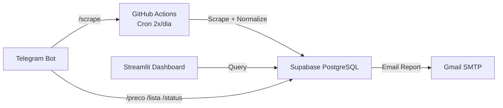

# CustoDoce - Memória do Projeto

## Sobre
Projeto de busca e comparação de preços de ingredientes para confeitaria.
Foco na Baixada Santista (Santos, São Vicente, Praia Grande, Mongaguá, Itanhaém, Peruíbe)
e São Paulo Capital. Infraestrutura 100% gratuita.

## Stack
- **DB/API**: Supabase (PostgreSQL) - 500MB free
- **Scrapers**: GitHub Actions (Python, 2.000 min/mês)
- **Dashboard**: Streamlit Cloud (Python, 1 app privado grátis)
- **Bot**: Telegram (python-telegram-bot)
- **Email**: Gmail SMTP (500 e-mails/dia)
- **AI/ML**: Sentence-Transformers (ONNX), Groq API, Scikit-learn (Isolation Forest)
- **Total Free Tier**: R$ 0,00

## Arquitetura



## Estrutura de Diretórios

```
CustoDoce/
├── .github/workflows/
│   ├── scrape.yml                   # Coleta automática (cron + deploy)
│   ├── ci.yml                       # CI: 7 jobs (lint → typecheck → docs-sync → unit → integration → deploy-check → real)
│   ├── e2e.yml                      # E2E quinzenal (Playwright + visual regression)
│   ├── backup.yml                   # Backup semanal pg_dump
│   ├── restore-test.yml             # Teste de restauração mensal
│   ├── deploy-staging.yml           # Deploy para ambiente de staging
│   └── on_demand_scrape.yml         # Scraping manual via workflow_dispatch
├── config/
│   ├── ingredients.yaml             # 23 ingredientes canônicos + aliases + search_terms
│   ├── stores.yaml                  # 51 lojas (Tier 1-4)
│   ├── features.yaml                # Flags declarativas liga/desliga
│   └── schema_prices.json           # Contrato de dados
├── scrapers/
│   ├── base_flyer.py, base_web_scraper.py  # ABCs
│   ├── flyer_scraper.py, flyer_parser.py   # PDF genérico
│   ├── vtex_scraper.py, website_scraper.py, carrefour_scraper.py  # E-commerce
│   ├── tenda_api_scraper.py, roldao_api_scraper.py, roldao_flyer_scraper.py, max_api_scraper.py  # APIs
│   ├── aggregator_scraper.py, playwright_scraper.py, playwright_price_scraper.py  # JS
│   ├── extra_flyer_scraper.py, pao_flyer_scraper.py  # Redes específicas
│   ├── ocr.py, unit_extractor.py
│   └── semantic_matcher.py          # Embeddings sentence-transformers (ONNX + cache)
├── parsers/
│   ├── normalizer.py                # Extrai unidade → R$/kg + R$/un
│   ├── matcher.py                   # token_set_ratio ≥80% (RapidFuzz)
│   ├── brand_extractor.py           # Extrai marca via YAML (3 níveis)
│   ├── llm_cache.py                 # Cache SQLite (TTL 30d) — Recurso 3
│   ├── llm_strategies.py            # Strategy Pattern (Groq/OpenRouter/HF) + Circuit Breaker + JSON Mode — Recurso 2
│   └── llm_classifier.py            # Orquestrador: cache → Groq → OpenRouter → HF → fallback seguro — Recurso 2
├── services/
│   ├── supabase_client.py           # Singleton conexão
│   ├── price_repository.py          # Queries brutas e acesso ao DB
│   ├── price_service.py             # Orquestração CRUD + busca + cleanup
│   ├── price_analytics.py           # Winners, trends, relatórios + otimizar_carrinho_compras (monofonte/multifonte) — Recurso 1
│   ├── price_intelligence.py        # Z-score + Isolation Forest (anomalias/ofertas)
│   ├── review_queue_service.py      # Gestão de aprovação/rejeição de matches
│   ├── collector.py                 # Orquestrador declarativo de coleta (Pipeline)
│   ├── config_db.py                 # DB-backed config (Ingredients/Stores)
│   ├── email_service.py, telegram_service.py, auth.py, rate_limiter.py
│   ├── alert_service.py             # Alertas proativos (ex: ingrediente sem preço > 48h)
│   ├── logger.py                    # Structured Logging (structlog)
│   ├── otel.py                      # Tracing (OpenTelemetry)
│   ├── dashboard_queries.py         # Query cache + extract_ppk/pun (single source)
│   ├── flyer_service.py             # Gerenciamento de flyers (PDFs)
│   ├── import_service.py            # Importação de dados externos
│   ├── maintenance_service.py       # Tarefas de manutenção programadas
│   ├── recipe_service.py            # Cálculo de receitas e ingredientes
│   └── types.py                     # Type hints e aliases compartilhados
├── dashboard/
│   ├── login_page.py, components/ (ui.py, layout.py)
│   └── pages/                       # 17 módulos (visao_geral, precos, historico, etc.)
├── telegram_bot/
│   └── handlers.py                  # /preco, /lista, /status — lê do DB (config_db), fallback YAML; fuzzy search (RapidFuzz); paginação inline keyboard
├── admin/app.py                     # 107 linhas — importa 17 pages + sidebar + login
├── supabase/
│   ├── seed.sql, consolidated_migration.sql
│   ├── 002_add_brand_column.sql
│   ├── 003_fix_price_history_trigger.sql
│   └── 004_add_llm_match_cache.sql   # Cache persistente de decisões LLM (Recurso 3)
├── scripts/
│   ├── deploy_database.py           # Migração SQL (--dry-run/--execute)
│   ├── deploy_check.py              # Health check pré-deploy
│   ├── validate_db_schema.py        # 87 checks de schema (via RPC)
│   ├── db_audit.py                  # Auditoria completa do DB
│   ├── sync_all_store_fields.py     # Sync stores.yaml ↔ DB + scrape_frequencies
│   ├── send_daily_report.py         # Relatório diário por email
│   ├── seed_prices.py               # Dados sintéticos
│   ├── sync_staging.py              # Sync Prod → Staging
│   ├── seed_staging.py              # Seed de teste para Staging
│   ├── validate_staging.py          # Health check do ambiente Staging
│   ├── run_quality_gates.py         # Great Expectations suite (5 expectations)
│   ├── sanity_check.py              # Sanity check pré-coleta
│   ├── sync_docs.py                 # Sincronização de documentação
│   ├── validate_production.py       # Validação completa de produção
│   ├── full_prod_validation.py      # Validador multi-fase (0-6)
│   ├── validation_phases/           # 7 módulos (phase0_static → phase6_health)
│   ├── archive/                     # 28 scripts históricos
│   └── ... (+30 scripts utilitários)
├── tests/
│   ├── unit/                        # 394 testes (19 arquivos) — dashboard + services + llm
│   ├── schema/                      # 94 testes parametrizados (1 arquivo)
│   ├── integration/                 # 13 arquivos — Benchmarks + DB integration (via RPC)
│   ├── design/                      # 1 arquivo — CSS/estrutura (10 testes)
│   ├── e2e/                         # 3 arquivos — Playwright E2E (requer setup)
│   └── real/                        # 2 arquivos — Scrapers reais (6 testes, slow/flaky)
├── main.py                          # Orquestrador: collect + cleanup + intelligence loop
├── pyproject.toml                   # Ruff (120 chars), mypy (3.12), pytest config
├── requirements.txt                 # Runtime: pdfplumber, supabase, streamlit, groq, torch, etc.
├── requirements-dev.txt             # ruff, bandit, pip-audit, mypy, pytest, psycopg2-binary
└── data/prices_latest.json          # Snapshot da última coleta
```

## Tiers de Lojas

| Tier | Tipo | Frequência | Como coleta |
|------|------|------------|-------------|
| 1 | PDF Direto (9 redes atacadistas) | Semanal (quarta/quinta) | pdfplumber + OCR fallback |
| 2a | E-commerce SP (VTEX API) | Diária | requests API |
| 2b | Atacado Físico SP (Manos, Jabaquara etc.) | Mensal | Manual - visita + planilha |
| 3 | Agregadores (Tiendeo, Guiato) | Fallback | Playwright / SSR |
| 4 | Manual (WhatsApp, visita local) | Sob demanda | Planilha .xlsx |

## Ingredientes Monitorados (23)

| # | Ingrediente | Categoria | Brands |
|---|-------------|-----------|--------|
| 1 | Leite Condensado Integral | lacteos | Moça, Piracanjuba, Italac, Itambé |
| 2 | Creme de Leite 20% Gordura | lacteos | Nestlé, Piracanjuba |
| 3 | Chocolate em Pó 50% Cacau | chocolates | Melken, Sicao |
| 4 | Leite em Pó Integral | lacteos | Ninho |
| 5 | Granulado Ao Leite | confeitos | Melken |
| 6 | Granulado Branco | confeitos | Melken |
| 7 | Granulado Meio Amargo | confeitos | Melken |
| 8 | Creme de Avelã | pastas | Nutella |
| 9 | Granulado Colorido | confeitos | Coloretti |
| 10 | Coco Ralado Grosso s/ Açúcar | secos | Socôco, Ducoco |
| 11 | Chocolate Nobre Blend | chocolates | Harald |
| 12 | Açúcar Mascavo | acucares | JR |
| 13 | Açúcar de Confeiteiro | acucares | Mavalerio |
| 14 | Chocolate em Pó 70% Cacau | chocolates | Sicao |
| 15 | Farinha de Trigo | farinhas | Dona Benta |
| 16 | Micro Ball | confeitos | Mavalerio |
| 17 | Top Confete Morango | confeitos | Harald |
| 18 | Gotas de Chocolate Branco | chocolates | Melken |
| 19 | Manteiga | lacteos | Aviação, Delícia, Itambé, Piracanjuba, Batavo, Vigor, Presidente, Tirolez |
| 20 | Gotas de Chocolate Meio Amargo | chocolates | Harald, Melken |
| 21 | Chocolate Meio Amargo em Barra | chocolates | Harald, Callebaut, Garoto |
| 22 | Fermento Químico em Pó | farinhas | Royal, Dona Benta |
| 23 | Essência de Baunilha | essencias | Mavalerio, Coza, Dr.Oetker |

## Fluxo de Coleta (GitHub Actions scrape.yml)

```
main.py → sync_store_fields() → para cada loja ativa:
  Tier 1 (PDF): build_url → HEAD (ETag) → download → MD5 cache → pdfplumber → OCR fallback
  Tier 2a (VTEX): GET api/products/search?ft= → parse JSON
  Tier 3 (site): GET /busca?q= → selectolax CSS selectors
  Todos → process_price_match():
    → match_ingredient() [exact → alias → word_subset → fuzzy RapidFuzz ≥80%]
    → se ≥80%: upsert_price_rpc() (server-side upsert via Supabase RPC)
    → se 55-79%: semantic_matcher blend (RapidFuzz 0.6 + embeddings 0.4)
    → se 65-80%: llm_classifier (Groq)
    → se <55%: review_queue com match_type, match_reason, brand, top3 candidatos
  Sexta/sábado (opcional): Playwright agregadores + OCR fila
  Fim: enrich_prices() [Isolation Forest] → commit data/prices_latest.json → send_daily_report.py (email)
  Processamento Extra: process_ocr_queue() → alert_service.process_proactive_alerts()
  1º do mês: release GitHub com snapshot .json.gz
```

## Matcher (parsers/matcher.py)

1. **Exato**: canonical name no texto do produto
2. **Apelido exato**: cada alias com `in` operator
3. **Contido**: todas as palavras do canonical no produto
4. **Fuzzy**: RapidFuzz `fuzz.token_set_ratio(product, canonical/alias)` ≥80%
5. **Match types PT**: `exato` / `proximo_nome` / `proximo_apelido` / `contido`
6. **Confidence Score**: 1.0 (exato), 0.8-1.0 (fuzzy ≥80%), <0.8 (review queue)
7. **Brand extraction**: 3 níveis (exato → substring regex → fuzzy palavra a palavra ≥80%)
8. **Review Queue**: items <80% vão pra `review_queue` com `match_type`, `match_reason`, `top3` candidatos, `brand`

## Normalizer (parsers/normalizer.py)

```
"cx 12x395g" → qty=12, unit_kg=0.395, total_kg=4.74
"2kg"        → qty=1,  unit_kg=2.0,   total_kg=2.0
"500g"       → qty=1,  unit_kg=0.5,   total_kg=0.5
"12un 395g"  → qty=12, unit_kg=0.395, total_kg=4.74
"lata 1kg"   → qty=1,  unit_kg=1.0,   total_kg=1.0

price_per_kg = raw_price / total_kg
price_per_un = raw_price / qty
```

## Tratamento de Erros

| Erro | Ação |
|------|------|
| PDF 404 | Loga aviso, pula loja |
| Timeout | Retry 2x, depois pula |
| ETag não mudou | Pula (cache hit) |
| pdfplumber vazio | OCR fallback (Tesseract) |
| Matcher <80% | Review queue (com match_reason detalhado) |
| Supabase offline | Salva em prices_latest.json local |
| Email falha | Loga erro, não bloqueia pipeline |
| Porta 5432 bloqueada | Usa exec_sql_query RPC (porta 443) |

## ⚠️ Regra Obrigatória: DB Sync

**Toda alteração em SQL/funções/triggers deve ser verificada na base real do Supabase antes de dar como concluída.** Usar REST API (RPC `exec_sql_query`), NÃO psycopg2 direto.

```bash
# Deploy e verificação via RPC (porta 443, funciona de qualquer rede)
python scripts/deploy_database.py --execute
# Teste comportamental
python -c "
from supabase import create_client; import os
s = create_client(os.environ['SUPABASE_URL'], os.environ['SUPABASE_SERVICE_ROLE_KEY'])
r1 = s.rpc('upsert_price_rpc', {...}).execute()
r2 = s.rpc('upsert_price_rpc', {...}).execute()
assert r1.data.get('id') == r2.data.get('id')  # dedup
"
# Rodar testes
ruff check . && python -m pytest tests/unit/ tests/schema/ -q
```

## Comandos Relevantes

```bash
# Lint + type + test
ruff check . && python -m mypy . && python -m pytest tests/unit/ tests/schema/ -q

# Testar scraper manualmente
python -c "from scrapers.base_flyer import BaseFlyerScraper; s = BaseFlyerScraper({'name':'Assaí','url_pattern':'...'}); print(s.run())"

# Testar normalizer
python -c "from parsers.normalizer import normalize_price; print(normalize_price(42.90, 'cx 12x395g'))"

# Testar matcher
python -c "from parsers.matcher import match_ingredient; ing = [{'canonical':'Leite Condensado','aliases':[]}]; print(match_ingredient('Leite Condensado Moça 12un', ing))"

# Testar bot handler manualmente
python -c "from telegram_bot.handlers import lista_command, preco_command; import asyncio; print(asyncio.run(lista_command(None, None)))"

# Verificar query params sync
python -c "from dashboard.pages.precos import render_precos; from dashboard.pages.historico import render_historico; print('OK')"

# Schema validation (via REST API, precisa .env com credenciais)
python scripts/validate_db_schema.py

# Migração SQL
python scripts/deploy_database.py --dry-run

# Gerar dados sintéticos
python scripts/seed_prices.py --dry-run
```

## Status Atual

**Fase 8 concluída (Full Project Overhaul).** 
- LLM Resilience + Cache (Strategy Pattern, Circuit Breaker, 3 providers) ✅
- Cart Optimizer (Monofonte/Multifonte) ✅
- Capacity Planning Dashboard ✅
- Staging Environment + CI/CD Unification ✅
- Observabilidade (structlog + OTel) ✅
- Feature Flags per-ingredient ✅

**Fase 9 concluída (CI Hygiene + Cleanup out 2026-06-28):**
- `git filter-branch` removed 11 sensitive files from 190 commits; pack 444MB → 8.7MB ✅
- 7 Dependabot alerts dismissed (Pillow 12.2.0 patched; `pip-audit --strict` clean) ✅
- Smart pre-push hook (Python + `sys.executable`) replaces bash + wslpath ✅
- `scripts/ci_local.py` — 8 config validators + 13 `tests/unit/test_ci_infrastructure.py` infra tests ✅
- `.gitattributes` (LF), `.gitignore` (`scripts/diagnose.py`), `data/prices_latest.json` removed ✅
- `check_ingredients.py` etc. use `# mypy: ignore-errors` (per-file directive) ✅
- 3 integration tests refactored from `psycopg2` to `exec_sql_query` RPC (porta 443) ✅
- `deploy_check.py` — required/optional env split; CI não bloqueia por secrets ausentes ✅

| Ferramenta | Status |
|------------|--------|
| pytest (unit + schema) | **488 passing** (20 files) | ✅ |
| pytest (integration) | **102 passing** | ✅ |
| pytest (design) | 10 tests | ✅ |
| pytest (e2e) | 0 collected (Playwright setup needed) | ⏳ |
| pytest (real) | 6 tests (slow/flaky) | ⏳ |
| ruff / mypy / bandit / pip-audit | clean | ✅ |
| CI lint / typecheck / docs-sync / unit / integration / deploy-check | passing | ✅ |
| CI deploy-check | required-passing, optional-warning | ✅ |

**Sprint 1 concluída (UX + Segurança + Bot DB Sync + Query Params) out 2026-06-28:**
- **1.1 Segurança**: Tabs `.env` (config.py) e YAML (lojas.py) removidas; banner info em ingredientes.py ✅
- **1.2 Bot DB Sync**: `handlers.py` reescrito — lê ingredientes ativos do DB (`config_db.get_active_ingredients()`) com fallback YAML; fuzzy search `rapidfuzz.fuzz.token_set_ratio`; paginação inline keyboard ✅
- **1.3 Mobile CSS**: Media queries 768px/640px; sidebar rail; tabelas sticky first column; safe-area padding; chart height limit ✅
- **1.4 Query Params**: `precos.py`, `historico.py`, `calculadora.py` — sincronização bidirecional (URL ↔ session_state) sem loop de rerender ✅
- **1.5 Acessibilidade**: Skip-link "Pular para conteúdo"; focus-visible em selectbox/checkbox; `prefers-reduced-motion` desliga animações; `font-variant-numeric: tabular-nums` em métricas ✅
- Meta: ruff/mypy/pytest **488 passing**; 0 novos warnings ✅

## Lições Aprendidas (CI/Mocks)

> **Estas regras foram aprendidas corrigindo 7+ erros consecutivos do CI.** Aplicar ANTES de escrever novos tests.

### 1. Mocks — boundary layer, not internal functions

```python
# ❌ ERRADO: patcha onde a função é definida
@patch("services.dashboard_queries.get_latest_prices_cached")
def test_x(): ...  # NÃO pega — Python resolves module-level imports

# ✅ CERTO: patcha onde é usada
@patch("dashboard.pages.relatorios.get_latest_prices_cached")
def test_x(): ...  # pega porque o module já importou
```

**Ou** marca como `@pytest.mark.integration` e deixa o conftest `db_conn` resolver via RPC.

### 2. Tests que tocam Supabase real — marque `integration`

Se um teste depende de estado Real DB, NÃO finja que mock cobre tudo. Marque com `@pytest.mark.integration`. `pyproject.toml` tem `addopts = "-m 'not slow and not integration'"` que pula automaticamente em unit CI, mantendo 100% determinístico.

### 3. `exec_sql_query` RPC (porta 443), NUNCA `psycopg2` (porta 5432)

GitHub Actions **bloqueia porta 5432** (exceto service containers). Use o fixture `db_conn` do `tests/conftest.py` que internamente chama `exec_sql_query` RPC. A `_SchemaCursor` mock psycopg2 cursor de forma transparente.

```python
# ❌ ERRADO (bloqueia no CI):
import psycopg2
conn = psycopg2.connect(host="db.fqdn.supabase.co", port=5432, ...)

# ✅ CERTO (funciona via porta 443):
def test_x(db_conn):  # fixture do conftest.py
    cur = db_conn.cursor()
    cur.execute("SELECT 1 FROM prices LIMIT 1")
    assert cur.fetchone() is not None
```

### 4. Cleanup POST test, não só PRE

Dados de runs anteriores Persistem em Supabase (não há sandbox). Setup PRE não basta — sempre cleanup POST também. Para testes que inserem dados únicos por chave `(ingredient_id, store_id, collected_at)`, **filtre por `collected_at = today`** ao validar.

### 5. `deploy_check.py` — required vs optional env

Required: `SUPABASE_URL`, `SUPABASE_SERVICE_ROLE_KEY`. Existem no GitHub Secrets.  
Optional: `GMAIL_*`, `AUTH_SECRET_KEY`, `SUPABASE_ANON_KEY`, `TELEGRAM_*` — opcionais em CI. Falhas opcionais viram WARN, não bloqueiam o job.

### 6. Pre-commit hook SECRETS GUARD — bloqueia, não skipa

Padrões: `sk-*`, `gsk_*`, `sk-or-*`, `sk-or-v1-*`, `sk-proj-*`, `hf_*`, `github_pat_*`, `nvapi-*`, `mOns*`, `AQ.*`. Se pattern estiver staged PARA IR no commit, bloqueia com exit 1.

### 7. `PIP_INDEX_URL` → `PIP_EXTRA_INDEX_URL`

Para torch CPU em CI: use `PIP_EXTRA_INDEX_URL=https://download.pytorch.org/whl/cpu` (preserva PyPI como primary). `PIP_INDEX_URL` SUBSTITUI PyPI e quebra `ruff`/`mypy` install.

### 8. `get_supabase()` deve ter fallback se `SUPABASE_ANON_KEY` faltar

`get_supabase()` (serviços/supabase_client.py:28) só lia `SUPABASE_ANON_KEY`. Se essa env var não está nas Secrets do CI, qualquer serviço que chame `get_supabase()` (config_db.py, dashboard_queries.py, etc.) falha com 401 mesmo que `SUPABASE_SERVICE_ROLE_KEY` exista.

```python
# ❌ ERRADO (quebra no CI se SUPABASE_ANON_KEY não configurada):
key = os.environ.get("SUPABASE_ANON_KEY")

# ✅ CERTO (fallback para service_role — sempre presente no CI):
key = os.environ.get("SUPABASE_ANON_KEY") or os.environ.get("SUPABASE_SERVICE_ROLE_KEY")
```

- `get_supabase()` agora prefere `SUPABASE_ANON_KEY` mas aceita `SUPABASE_SERVICE_ROLE_KEY` como fallback.
- `get_service_client()` SEMPRE prefere `SUPABASE_SERVICE_ROLE_KEY` (inalterado).
- `ci_local.py` valida que `SUPABASE_URL`, `SUPABASE_SERVICE_ROLE_KEY`, `GROQ_API_KEY` estão presentes localmente antes do push.

### 9. `SUPABASE_ANON_KEY` deve ser passado explicitamente nos jobs CI

`get_supabase()` tem fallback para `SUPABASE_SERVICE_ROLE_KEY`, mas alguns jobs CI (integration, deploy-check, real) precisam de `SUPABASE_ANON_KEY` explicitamente no `step.env`. A secret existe no GitHub mas precisa ser mapeada no workflow — mesmo que `get_supabase()` funcione localmente sem ela (via fallback). Sempre adicionar `SUPABASE_ANON_KEY: ${{ secrets.SUPABASE_ANON_KEY }}` junto das demais env vars do Supabase.

### 10. `exec_sql_query` RPC — sem trailing semicolons

O RPC `exec_sql_query` (definido em `consolidated_migration.sql:959`) envolve o SQL submetido em:
```sql
SELECT COALESCE(json_agg(row_to_json(d)), '[]'::json) FROM (%s) d
```
SQL com `;` no final quebra a subquery. Remova qualquer `;` no final de queries enviadas via `client.rpc("exec_sql_query", {"sql": sql})`.

## OpenCode Skills Strategy

Este projeto usa **duas camadas de skills OpenCode**:

| Camada | Localização | Propósito |
|--------|-------------|-----------|
| **Global** | `~/.config/opencode/skills/` | 17 skills universais usáveis em qualquer projeto |
| **Local (CustoDoce)** | `.opencode/skills/` | 7 overlays que injetam contexto específico do projeto |

### Skills Globais (17)

| Skill | Foco |
|-------|------|
| `scraping-resilience` | Anti-bot, fallback chain, proxy, CAPTCHA, error taxonomy |
| `code-quality-pro` | SOLID, Clean Code, security (bandit, pip-audit, detect-secrets) |
| `test-architect` | Pirâmide de testes, mocks, factories, contracts, CI integration |
| `api-design` | REST/GraphQL patterns, RFC 7807, OpenAPI, versioning |
| `code-review` | Checklist por severidade (CRITICAL/HIGH/MEDIUM/LOW) |
| `debug-troubleshooting` | Fluxo universal 4 passos + tabelas Python/Supabase/Streamlit/GHA |
| `docs-writer` | README, API doc, ADR, Runbook, Decision Panel templates |
| `git-workflow` | GitHub Flow, conventional commits, release/hotfix, aliases |
| `github-actions` | Workflows, caching, matrix, secrets, free-tier math |
| `project-doc-sync` | `scripts/sync_docs.py` — AGENTS.md, pages, workflows auto-sync |
| `refactor-patterns` | 6 patterns: Extract Method, Polymorphism, Primitive Obsession, etc. |
| `sql-optimizer` | Index design, RLS, partitioning, migration safety, RPC patterns |
| `streamlit` | Execution model, caching, multipage, layout, antipatterns |
| `telegram-bot` | python-telegram-bot v20+, async, ConversationHandler, dedup |
| `test-generation` | Unit/integration templates, parametrized, fixtures, Hypothesis |
| `humanizer` | 29 AI patterns removal + voice calibration |
| `seo` | 16 sub-skills, deterministic audit workflow, scripts |
| `ui-ux-pro-max` | 99 UX guidelines, 161 palettes, 57 font pairings, 10 priority categories |

### Overlays Locais (7 — em `.opencode/skills/`)

| Overlay | Conteúdo específico CustoDoce |
|---------|------------------------------|
| `telegram-bot` | Comandos `/preco /lista /status`, REST 443, dedup cron |
| `docs-writer` | AGENTS.md, ADRs, runbooks, sync_docs.py |
| `sql-optimizer` | Schema `prices`, RPCs, índices, migration workflow |
| `streamlit` | 17 pages, login gate, kpi_card, column_config, RPC 443 |
| `api-design` | Supabase REST/RPC real, auth boundaries, RPC naming |
| `github-actions` | 7 workflows + free-tier math (818 min/mês) |
| `project-doc-sync` | Cobertura do `sync_docs.py` |

**Como funciona:** Abra este repo no OpenCode → carrega globais + overlays. Abra outro projeto → só globais. Overlays são versionados com o repo.

## Ambiente

**Regra: escolha o executor mais rápido para cada tarefa.**

| Tarefa | Executor | Motivo |
|--------|----------|--------|
| ruff, mypy, pytest (unit/schema) | **Windows** (PowerShell) | Nativo, sem overhead de WSL |
| Shell scripts (.sh) | **WSL (Debian)** | PowerShell/cmd quebra escapes, shebang, `&&` |
| Git filter-branch, rebase | **WSL (Debian)** | PowerShell heredoc quebra `\` escapes |
| Simular CI Linux (act, bash) | **WSL (Debian)** | GitHub Actions usa Linux |
| Playwright, scrapers reais, OCR | **WSL (Debian)** | Browser automation mais estável |
| Scripts de deploy, DB, SQL | **Windows** | python direto funciona; WSL para scripts .sh |

**Windows (PowerShell) — padrão para Python:**
```powershell
# Verificar ambiente
python --version    # deve ser 3.11+
python -m ruff check .
python -m mypy .
python -m pytest tests/unit tests/schema -q
```

**WSL (Debian) — para Git/shell/CI:**
```bash
# Sempre usar bash absoluto
bash /mnt/c/.../scripts/rewrite.sh
# Nunca fazer cd dentro de heredoc PowerShell
# Usar cmd /c para .bat ou bash -c para .sh
```

**Configurações obrigatórias (Windows):**
```powershell
git config core.hooksPath .githooks   # ativa hooks
git config core.autocrlf false         # LF = LF (nao converte CRLF)
git config core.fileMode false         # permissoes nao travam em Windows
```

**Pre-commit hook (`.githooks/pre-commit`):**
- SECRET GUARD: BLOQUEIA se `sk-*`, `gsk_*`, `sk-or-*` etc. forem staged (irreversivel)
- DOC SYNC: AVISA se codigo mudou sem changelog (usuario confirma com ENTER)
- SIZE GUARD: BLOQUEIA se arquivo >100MB staged (GitHub rejeita)
- DOC WATCHDOG: AVISO leve sobre tests/README

**Pre-push hook (`.githooks/pre-push`):**
- Valida: working tree limpo + audit_secrets --strict + ruff + mypy
- Se qualquer um falhar: push NAO acontece
- Pular (emergencia): `git push --no-verify` (NAO recomendado)

**Scripts de seguranca:**
- `scripts/audit_secrets.py --strict` — varre historico por chaves
- `scripts/install_hooks.sh` — instala/re-instala hooks (shell-based, run apos clone via WSL)
- `Makefile` — targets consolidados para Windows
