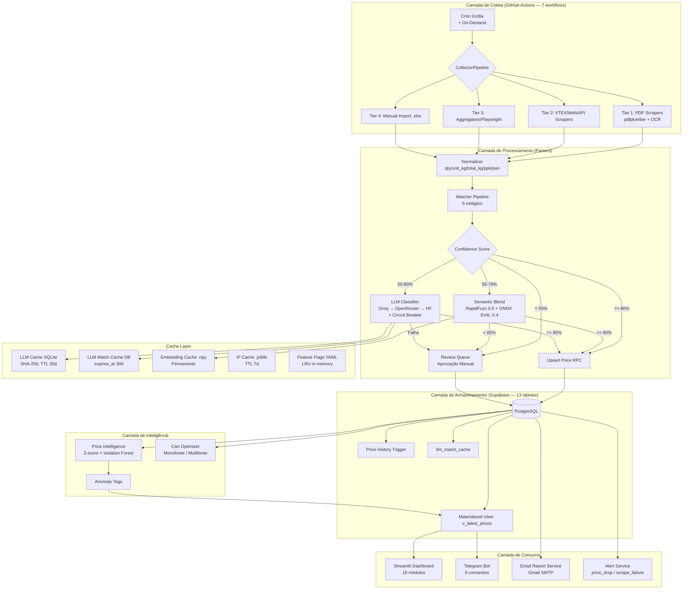
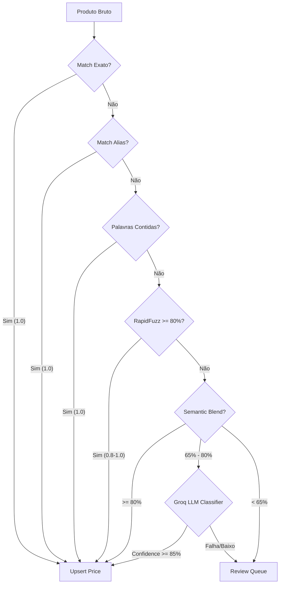

# Arquitetura Técnica — CustoDoce
> Última atualização: 2026-07-17 04:28 UTC

Este documento descreve a arquitetura de software, o fluxo de dados e as decisões de design do sistema CustoDoce.

## 1. Fluxo de Dados Global (Data Flow)

O sistema opera em um ciclo de coleta, processamento, armazenamento e consumo.

## 2. Pipeline de Matching (A Lógica de Confiança)

O matcher opera em cascata. Se um estágio confirma o ingrediente com alta confiança, o processo para. Caso contrário, ele desce para métodos mais complexos e computacionalmente caros.

### Detalhes do Semantic Blend
O score semântico é calculado como:
`Score Final = (0.6 * RapidFuzz_Score) + (0.4 * Cosine_Similarity_ONNX)`

## 2.1. LLM Resilience (3 Providers + Circuit Breaker)

O LLM Classifier usa **Strategy Pattern** com fallchain em cascata:

| Ordem | Provider | Modelo | JSON Mode | Circuit Breaker |
|-------|----------|--------|-----------|-----------------|
| 1º | Groq | `llama-3.3-70b-versatile` | ✅ | 3 falhas → 10min cooldown |
| 2º | OpenRouter | `mixtral-8x7b-instruct` | ✅ | 3 falhas → 10min cooldown |
| 3º | HuggingFace | `Mistral-7B-Instruct-v0.2` | ✅ | 3 falhas → 10min cooldown |

**Cache em 2 níveis:**
1. **SQLite local** (`llm_cache.py`) — SHA-256 do prompt, TTL 30 dias
2. **Supabase** (`llm_match_cache`) — backup persistente com `expires_at`

## 3. Design do Banco de Dados (Supabase)

O banco foi otimizado para leitura rápida no dashboard e integridade absoluta na escrita.

### Estratégia de Performance
- **Generated Columns**: `price_per_kg` é calculado automaticamente no banco para evitar processamento no Python.
- **Materialized View (`v_latest_prices`)**: Consolida o último preço de cada ingrediente por loja, eliminando a necessidade de queries complexas de `DISTINCT ON` em tempo real.
- **RPC (Remote Procedure Calls)**: Toda a lógica de `upsert` (inserir ou atualizar) reside no servidor via PL/pgSQL para garantir atomicidade e performance.

### Tabela de Preços vs Histórico
- **`prices`**: Mantém apenas o estado atual (última coleta válida).
- **`price_history`**: Alimentada por um `TRIGGER` automático. Sempre que um preço em `prices` é atualizado, o valor antigo é movido para o histórico.

## 4. Estratégia de Tiers (Hierarquia de Coleta)

| Tier | Definição | Método | Frequência | Impacto |
|------|-----------|---------|------------|----------|
| **1** | Atacadistas Base | PDF $\rightarrow$ OCR $\rightarrow$ Texto | Semanal | Volume massivo, alta confiança |
| **2** | E-commerce Especializados | API VTEX $\rightarrow$ JSON | Diária | Preços precisos, alta frequência |
| **3** | Agregadores | Playwright $\rightarrow$ SSR $\rightarrow$ HTML | Fallback | Cobertura de brechas, menor confiança |
| **4** | Lojas Locais | Planilha $\rightarrow$ CSV/XLSX | Mensal | Dados exclusivos de nicho |

---

## 5. Cart Optimizer (Calculadora Inteligente)

O `price_analytics.otimizar_carrinho_compras()` calcula o custo de uma lista de ingredientes em 2 cenários:

| Cenário | Descrição | Algoritmo |
|---------|-----------|-----------|
| **Monofonte** | Loja única que vende a lista inteira pelo menor valor | Para cada loja, testa cobertura 100%; escolhe a de menor total |
| **Multifonte** | Divide a compra em até N lojas (default 2) | Combinações O(n²); escolhe mais barata por ingrediente |

Retorna: economia percentual, lojas recomendadas e tabela formatada (markdown + HTML).

## 6. Observabilidade (Structlog + OpenTelemetry)

| Componente | Tecnologia | Saída |
|------------|-----------|-------|
| **Logging** | `structlog` | JSON em produção, console colorido em dev |
| **Tracing** | OpenTelemetry | `OTLPSpanExporter` em prod, `ConsoleSpanExporter` em local |
| **Capacity Planning** | Dashboard | Disco vs 500MB, Actions vs 2000min, SMTP vs 500/dia |

## 7. Segurança e Isolamento

- **RLS (Row Level Security)**: O Dashboard acessa dados via `anon key` com permissões de leitura.
- **Service Role**: Apenas o Orquestrador (GitHub Actions) e scripts de deploy usam a `service_role` para bypass de RLS e escrita.
- **Rate Limiting**: Implementado via SQLite local nos scrapers para evitar banimentos de IP (429 Too Many Requests).
- **Feature Flags**: Sistema em 2 níveis (global + per-ingrediente) via `config/features.yaml` + `services/config.py`
